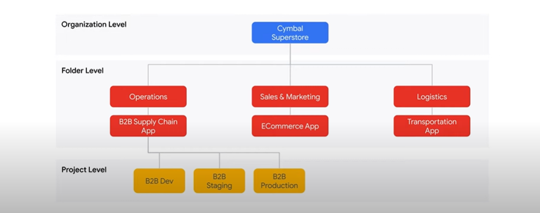
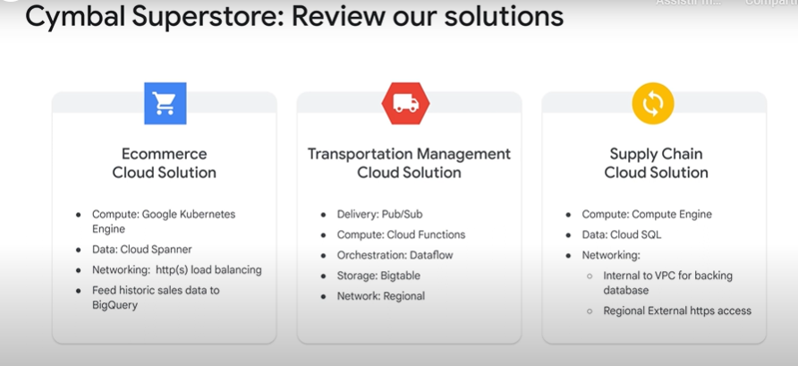

# Associate Cloud Engineer

## Laboratório prático - Um tour pelo Google Cloud

Realizando um pequeno laboratório, um tour pelos principais recursos do Google Cloud

## Preparing for Your Associate Cloud Engineer Journey

### Introdução

Vídeos introdutórios de preparação de certificação Associate Cloud Engineer

O que é um Associate Cloud Engineer?

Um Associate Cloud Engineer implanta e protege aplicativos e a infraestrutura, monitora operações de vários projetos e mantém soluções empresariais para garantir que elas atendam às métricas de desempenho desejadas.
Esse profissional tem experiência em trabalhar com nuvens públicas e soluções locais.
Ele sabe usar o console do Google Cloud e a interface da linha de comando para realizar tarefas comuns na plataforma
e manter e dimensionar uma ou mais soluções implantadas que usam os serviços gerenciados pelo Google ou autogerenciados no Google Cloud.

Diferença entre o certificado de Associate e Professional?
Os dois níveis de certificação têm pontos em comum.
Mas apenas a certificação "Professional" exige que o candidato saiba avaliar os estudos de caso e criar soluções que atendam aos requisitos do negócio.
O nível "Associate" se concentra basicamente nos requisitos técnicos e na implementação do cliente, que é onde você deve focar seus esforços.

## Módulo 1

### Como configurar um ambiente de solução de nuvem

Definindo como será a migração dos aplicativos de uma empresa para o Google Cloud e quais recursos utilizar

Conceder os permissionamento necessários no IAM para os departamentos

Criação de billing accountos para os departamento, como um centro de custo, em que cada departamento terá seus custos de forma separada

## Questões de diagnóstico

1. Stella, uma nova participante de uma equipe da suWa empresa, foi encarregada de monitorar as instâncias de VM da organização. Stella precisa das permissões necessárias para desempenhar esse papel. O que você deve fazer para conceder a ela essas permissões?

    :black_large_square: Atribuir a Stella permissões compute.instances.get em todos os projetos que ela precisa monitorar.

    :black_large_square: Atribuir a Stella a política de “Leitor”.

    :white_check_mark: Adicionar Stella a um Grupo do Google da sua organização. Vincular esse grupo a roles/compute.viewer.

    :black_large_square: Atribuir a Stella um papel roles/compute.viewer.

> Você não deve atribuir papéis a um usuário individual. Os usuários devem ser adicionados a grupos, que, por sua vez, devem receber papéis para simplificar o gerenciamento de permissões.

---

2. O departamento de operações da Cymbal Superstore quer fornecer aos gerentes acesso às informações sobre o uso de VM, sem permitir que eles façam alterações que afetem o estado. Você atribui a eles o papel Leitor do Compute Engine. Quais duas permissões eles vão receber?

    :black_large_square: compute.images.setIAM

    :white_check_mark: compute.images.list

    :black_large_square: compute.images.create

    :white_check_mark: compute.images.get

    :black_large_square: computer.images.update

---

3. Você precisa adicionar novos grupos de funcionários ao ambiente de produção da Cymbal Superstore seguindo a recomendação do Google de usar o privilégio mínimo. O que você deve fazer?

    :white_check_mark: Conceder papéis predefinidos e personalizados que fornecem as permissões necessárias e conceder papéis básicos somente quando necessário.

    :black_large_square: Conceder os papéis básicos menos restritivos à maioria dos serviços e conceder papéis predefinidos e personalizados somente quando necessário.

    :black_large_square: Conceder papéis personalizados a usuários individuais e implementar papéis básicos no nível do recurso.

    :black_large_square: Conceder o papel básico mais restritivo à maioria dos serviços, conceder papéis predefinidos ou personalizados, conforme necessário.

> Os papéis básicos são amplos demais e não fornecem privilégio mínimo.

---

4. Quais atributos de projeto do Google Cloud podem ser alterados?

    :black_large_square: A categoria do projeto.

    :black_large_square: O ID do projeto.

    :black_large_square: O número do projeto.

    :white_check_mark: O nome do projeto.

---

5. Como as contas de faturamento são aplicadas aos projetos no Google Cloud? Escolha duas respostas.

    :white_check_mark: A conta de faturamento pode ser vinculada a um ou mais projetos.

    :black_large_square: Um projeto e seus recursos podem ser vinculados a mais de uma conta de faturamento.

    :black_large_square: Se o projeto só usar recursos sem custo financeiro, você não vai precisar de um link para uma conta de faturamento ativa.

    :black_large_square: Configurar o Cloud Billing para pagar os custos de uso nos projetos do Google Cloud e nas contas do Google Workspace.

    :white_check_mark: Um projeto e seus recursos só podem ser vinculados a uma conta de faturamento.

---

6. Como as hierarquias de recurso são organizadas no Google Cloud?

    :black_large_square: Organização, projeto, recurso, pasta

    :black_large_square: Projeto, organização, pasta, recurso

    :white_check_mark: Organização, pasta, projeto, recurso

    :black_large_square: Recurso, pasta, organização, projeto

---

7. Selecione duas opções abaixo que oferece uma interface de linha de comando para o Google Cloud.

    :white_check_mark: SDK Cloud

    :black_large_square: Console do Google Cloud

    :black_large_square: Cloud Mobile App

    :black_large_square: API baseada em REST

    :white_check_mark: Cloud Shell

---

8. Fiona é a administradora de faturamento do projeto associado ao aplicativo de e-commerce da Cymbal Superstore. Jeffrey, chefe do departamento de marketing, quer receber os e-mails relacionados a alertas de orçamento. Jeffrey não deve ter acesso a informações extras de faturamento. O que você deve fazer?

    :black_large_square: Alterar as regras padrão de limite de alerta de orçamento para incluir Jeffrey como destinatário.

    :black_large_square: Adicionar Jeffrey e Fiona à caixa de diálogo de envio de e-mail personalizado do escopo do orçamento.

    :black_large_square: Enviar alertas a um tópico do Pub/Sub em que Jeffrey é inscrito.

    :white_check_mark: Usar os canais de notificação do Cloud Monitoring para enviar a Jeffrey um alerta por e-mail.

---

9. Você pretende usar o Cloud Shell para copiar arquivos para seu bucket do Cloud Storage. Qual comando do SDK Cloud você deve usar?

    :black_large_square: Navegador do Cloud Storage

    :black_large_square: bq

    :white_check_mark: gcloud storage

    :black_large_square: gcloud

> O gcloud fornece ferramentas para interagir com os recursos e serviços no SDK Cloud.

---

10. Jane vai gerenciar objetos no Cloud Storage para a Cymbal Superstore. Ela precisa ter acesso às permissões adequadas de cada projeto em toda a organização. O que você deve fazer?

    :black_large_square: Atribuir a Jane o papel roles/viewer em cada projeto e o roles/storage.objectCreator para cada bucket.

    :black_large_square: Atribuir a Jane o papel roles/editor no nível da organização.

    :white_check_mark: Adicionar Jane a um grupo que tenha o papel roles/storage.objectAdmin atribuído no nível da organização.

    :black_large_square: Atribuir a Jane o papel roles/storage.objectCreator em todos os projetos.

---

### Questões de revisão

1. Qual é a função básica de nível mais baixo que lhe dá permissões para alterar o estado do recurso?

    :black_large_square: Proprietário

    :black_large_square: Visualizador

    :white_check_mark: Editor

    :black_large_square: Administrador

---

2. Qual interface do Google Cloud permite ações de script em um conjunto de executáveis ​​de linha de comando?

    :black_large_square: API REST

    :white_check_mark: Cloud Shell

    :black_large_square: Cloud Mobile App

    :black_large_square: Console do Google Cloud

---

## Módulo 2

### Como planejar e configurar uma solução de nuvem

Definindo os recursos que serão utilizados na migração dos apps da Cymbal para o GCP

### Questões de diagnóstico

1. Qual opção de balanceamento de carga do Google Cloud é executada na camada 7 da pilha TCP?

    :black_large_square: Proxy SSL global

    :black_large_square: Rede regional

    :white_check_mark: HTTP(S) global

    :black_large_square: Proxy TCP global

---

2. A Cymbal Superstore decide testar um aplicativo de nuvem para seu sistema de ponto de venda na loja principal. Você quer se dedicar ao código e desenvolver a solução rapidamente. Além disso, você precisa que o código tenha portabilidade. O que você deve fazer?

    :black_large_square: Implementar um manifesto de implantação e executar kubectl apply nele pelo Google Kubernetes Engine.

    :black_large_square: Executar SSH em uma VM do Compute Engine e também seu código.

    :black_large_square: Escrever o código da sua solução no Cloud Functions.

    :white_check_mark: Empacotar seu código em uma imagem de contêiner e publicá-lo no Cloud Run.

---

3. A Cymbal Superstore precisa analisar se atingiu as projeções de vendas trimestrais. Os analistas com a tarefa de executar essa consulta conhecem SQL. Qual solução de dados eles devem implementar?

    :black_large_square: Cloud Spanner

    :white_check_mark: O BigQuery

    :black_large_square: Cloud Firestore

    :black_large_square: Cloud SQL

---

4. O aplicativo da cadeia de suprimentos da Cymbal Superstore analisa frequentemente grandes volumes de dados para informar os processos de negócios e painéis operacionais. Qual classe de armazenamento seria adequada para esse caso de uso?

    :black_large_square: Coldline

    :white_check_mark: Standard

    :black_large_square: Archive

    :black_large_square: Nearline

---

5. A Cymbal Superstore está testando uma atualização do app de e-commerce da loja principal em Minneapolis, Minnesota. O aplicativo é implementado como um serviço da Web de três níveis com tráfego proveniente da área local e recursos dedicados a ele em us-central1. Você precisa configurar uma arquitetura de balanceamento de carga de rede segura e de baixo custo para ele. O que você deve fazer?

    :black_large_square: Implementar um balanceador de carga de rede TCP/UDP externo com proxy conectado no nível da Web como front-end e um balanceador de carga SSL de nível de rede Premium entre o nível da Web e o back-end.

    :black_large_square: Configurar um balanceador de carga SSL com proxy conectado ao nível da Web como front-end e um balanceador de carga TCP/UDP interno no nível Standard entre o nível da Web e o back-end.

    :black_large_square: Implementar um balanceador de carga HTTPS externo de passagem no nível Premium conectado ao nível da Web como front-end e um balanceador de carga regional interno entre o nível da Web e o back-end.

    :white_check_mark: Configurar um balanceador de carga HTTPS externo com proxy de nível Standard conectado ao nível da Web como front-end e um balanceador de carga regional interno entre o nível da Web e o back-end.

---

6. A Cymbal Superstore precisa preencher painéis visuais com dados históricos baseados em tempo. Este caso de uso é analítico. Quais duas soluções de armazenamento podem ser usadas? https://cloud.google.com/bigtable/docs/overview#other-storage-options

    :white_check_mark: O BigQuery

    :white_check_mark: Cloud Bigtable

    :black_large_square: Cloud Storage

    :black_large_square Cloud Firestore

    :black_large_square: Cloud SQL

---

7. A projeção do volume de armazenamento em nuvem necessário para que a Cymbal Superstore permita aos usuários postarem imagens para análises de projeto é 10 TB de armazenamento de acesso imediato nos EUA e 30 TB de armazenamento para postagens históricas em um bucket localizado perto da matriz da Cymbal Superstore. Será necessário acessar o conteúdo desse bucket a cada 30 dias. Você quer estimar o custo desses recursos de armazenamento para garantir que seja economicamente viável. O que você deve fazer?

    :black_large_square: Usar a calculadora de preços para estimar o preço por 10 TB de Standard Storage regional, 30 TB de Nearline Storage regional e cobranças de entrada por postagens no bucket.

    :white_check_mark: Usar a calculadora de preços para estimar o preço por 10 TB de Standard Storage multirregional, 30 TB de Nearline regional e cobranças de saída por leituras do bucket.

    :black_large_square: Usar a calculadora de preços para estimar os custos por 10 TB de Standard Storage regional, 30 TB de Coldline Storage regional e cobranças de saída por leituras do armazenamento.

    :black_large_square: Usar a calculadora de preços para estimar o preço por 10 TB de Standard Storage multirregional, 30 TB de Coldline Storage regional e cobranças de entrada por postagens no bucket.

---

8. A Cymbal Superstore decide migrar seu aplicativo da cadeia de suprimentos para o Google Cloud. Você precisa configurar dependências específicas do sistema operacional. O que você deve fazer?

    :black_large_square: Implementar um aplicativo usando contêineres no Google Kubernetes Engine.

    :black_large_square: Implementar um aplicativo usando contêineres no Cloud Run.

    :white_check_mark: Implementar um aplicativo usando máquinas virtuais no Compute Engine.

    :black_large_square: Implementar um aplicativo usando código no App Engine.

---

9. Um aplicativo em execução em uma versão altamente personalizada do Ubuntu precisa ser migrado para o Google Cloud. Você deve fazer isso no menor tempo possível com mínimas alterações no código. O que você deve fazer?

    :black_large_square: Implantar o aplicativo em uma imagem de contêiner no Cloud Run.

    :black_large_square: Implantar o aplicativo atual no App Engine.

    :white_check_mark: Criar máquinas virtuais do Compute Engine e migrar o app para essa infraestrutura.

    :black_large_square: Implementar um cluster do Kubernetes e criar pods para ativar o app.

---

10. Você quer implantar um aplicativo de microsserviços. Você precisa de controle total do gerenciamento de contêineres, confiabilidade e escalonamento automático, mas não quer ou não precisa gerenciar o plano de controle. Qual opção de computação você deve usar?

    :black_large_square: Cloud Run

    :black_large_square: App Engine

    :white_check_mark: Google Kubernetes Engine

    :black_large_square: Compute Engine

---

### Questões de revisão

1. Qual opção sem servidor é baseada no desenvolvimento e na execução de pequenos snippets de código?

    :black_large_square: Dataflow

    :black_large_square: Cloud Run

    :white_check_mark: Cloud Functions

    :black_large_square: BigQuery

---

2. Qual classe de armazenamento foi projetada para armazenamentos de longo prazo com um contrato mínimo de 365 dias e um preço menor do que as outras?

    :black_large_square: Coldline Storage

    :black_large_square: Standard Storage

    :black_large_square: Nearline Storage

    :white_check_mark: Archive Storage

---

## Módulo 3

### Como implantar e implementar uma solução de nuvem

Cenário da Cymbal

### Questões de diagnóstico

1. Que tipo de rede de nuvem privada virtual (VPC) permite controlar totalmente intervalos de IPs e a definição de sub-redes regionais?

    :black_large_square: Rede de modo automático

    :black_large_square: Uma rede de modo automático convertida em rede personalizada

    :white_check_mark: Rede de modo personalizado

    :black_large_square: Rede de projeto padrão

> Uma rede de modo automático cria uma sub-rede em cada região do Google Cloud automaticamente com um conjunto predefinido de intervalos de IPs.

---

2. O departamento de vendas da Cymbal Superstore tem um banco de dados MySQL de tamanho médio. Esse banco de dados inclui papéis definidos pelo usuário, sendo usado internamente pelo departamento de marketing na sede da Cymbal Superstore. O departamento de vendas solicita que você migre o banco de dados no Google Cloud da forma mais oportuna e econômica. O que você deve fazer?

    :white_check_mark: Configurar uma VM do Compute Engine com um tipo de máquina N2, instalar o MySQL e restaurar os dados na nova instância.

    :black_large_square: Usar o gcloud para implementar uma instância do Compute Engine com um tipo de máquina E2-standard-8, instalar e configurar o MySQL.

    :black_large_square: Encontrar uma imagem da máquina MySQL no Cloud Marketplace e configurá-la de acordo com as suas necessidades.

    :black_large_square: Implementar uma instância de banco de dados usando o Cloud SQL, fazer backup dos dados locais e restaurá-los na nova instância.

> O Cloud SQL não aceita funções definidas pelo usuário, que são usadas no banco de dados que está sendo migrado.

---

3. O departamento de marketing da Cymbal Superstore precisa carregar no BigQuery alguns dados que se alteram lentamente. Os dados chegam de hora em hora em um bucket do Cloud Storage. Você pretende minimizar o custo e implementar isso com o menor número de etapas possível. O que você deve fazer?

    :black_large_square: Criar uma função do Cloud para enviar dados ao BigQuery por um pipeline do Dataflow.

    :white_check_mark: Usar o serviço de transferência de dados do BigQuery para programar uma transferência entre o bucket e o BigQuery.

    :black_large_square: Implementar um comando bq load em um script de linha de comando e programá-lo com o cron.

    :black_large_square: Ler os dados do bucket usando a API de streaming do BigQuery em um programa.

> Haverá cobranças por um pipeline do Dataflow referentes aos recursos que realizam a coleta no BigQuery.

---

4. A Cymbal Superstore solicita que você implemente o Cloud SQL como back-end de banco de dados no aplicativo de cadeia de suprimentos. Você pretende configurar o failover automático em caso de uma falha temporária de zona. Para isso, você decide usar o conjunto de comandos gcloud sql instances create. Que argumento de linha de comando gcloud é necessário para configurar o recurso de failover indicado à medida que você cria as instâncias necessárias?

    :white_check_mark: --availability-type

    :black_large_square: --replica-type

    :black_large_square: --master-instance-name

    :black_large_square: --secondary-zone

> Se você tem --master-instance-name, essa opção permite definir o tipo de réplica: um padrão de leitura ou um tipo de réplica MySQL legado de failover, que foi descontinuado.

---

5. Você precisa analisar e executar uma ação em relação aos arquivos que estão sendo adicionados a um bucket do Cloud Storage. Sua equipe de programação é proficiente em Python. A análise que você precisa fazer leva no máximo 5 minutos. Você implementa uma função do Cloud para concluir o processamento e especificar um recurso de gatilho voltado ao seu bucket. Como você deve configurar o parâmetro --trigger-event usando o gcloud?

    :black_large_square: --trigger-event google.storage.object.create

    :black_large_square: --trigger-event google.storage.object.add

    :black_large_square: --trigger-event google.storage.object.change

    :white_check_mark: --trigger-event google.storage.object.finalize

---

6. O back-end do sistema de e-commerce da Cymbal Superstore consiste em grupos gerenciados de instâncias. Você precisa atualizar o sistema operacional das instâncias de forma automatizada usando o mínimo de recursos. O que fazer?

    :black_large_square: Criar um modelo de instância. Clicar em Atualizar VMs. Definir a sobrecarga máxima como 5. Clique em Iniciar.

    :black_large_square: Abandonar cada uma das instâncias no grupo gerenciado de instâncias. Excluir o modelo de instância, substituí-la por uma nova e recriar as instâncias no grupo gerenciado.

    :black_large_square: Criar um modelo de instância. Clicar em Atualizar VMs. Definir o tipo de atualização como oportunista. Clicar em Iniciar.

    :white_check_mark: Criar um modelo de instância e clicar em Atualizar VMs. Definir o tipo de atualização como PROATIVA. Clique em Iniciar.

> As atualizações "Oportunistas" não são interativas.

---

7. A equipe de desenvolvimento do projeto de cadeia de suprimentos está pronta para começar a criar o novo app de nuvem usando um cluster pequeno do Kubernetes para o piloto. O cluster só deve ser disponibilizado a membros da equipe, não precisa estar altamente disponível. Os desenvolvedores também precisam de habilidade para alterar a arquitetura de cluster conforme implantam novos recursos. Como você faz essa implementação?

    :black_large_square: Implementar um cluster do Autopilot na us-central1-a com um pool padrão e uma imagem do Ubuntu.

    :black_large_square: Implementar um cluster do Autopilot na us-central1 com um tipo de imagem do Ubuntu.

    :white_check_mark: Implementar um cluster zonal padrão particular na us-central1-a com um pool padrão e uma imagem do Ubuntu.

    :black_large_square: Implementar um cluster regional padrão particular na us-central1 com um pool padrão e o tipo de imagem otimizado para contêiner.

> A imagem otimizada para contêiner que aceita o tipo do Autopilot não é compatível com pacotes personalizados.

---

8. Você precisa de um bucket do Cloud Storage para atender usuários de Nova York e São Francisco. Os usuários de Londres não vão usar esse bucket. Você não pretende usar ACLs. Que comando da CLI você usa?

    :white_check_mark: Execute um comando gcloud storage buckets create, sem especificar –-location.

    :black_large_square: Execute um comando gcloud storage objects e especifique --remove-acl-grant.

    :black_large_square: Executar um comando gsutil mb especificando um local multirregional e uma opção para desativar a avaliação de ACL.

    :black_large_square: Execute um comando gcloud storage buckets create com a especificação –-placement us-east1, europe-west2.

---

9. Que ação o comando terraform apply executa ?

    :black_large_square: Mostra uma prévia dos recursos que vão ser criados.

    :black_large_square: Faz o download da versão mais recente do provedor do Terraform.

    :black_large_square: Verifica a sintaxe do arquivo de configuração do Terraform.

    :white_check_mark: Configura os recursos solicitados no arquivo de configuração do Terraform.

---

10. Você precisa implantar rapidamente um aplicativo da Web conteinerizado no Google Cloud. Você conhece os serviços que pretende expor. Você não quer gerenciar a infraestrutura. Você só quer pagar quando as solicitações forem tratadas e precisarem de suporte para pacotes personalizados. Que tecnologia atende a essas necessidades?

    :white_check_mark: Cloud Run

    :black_large_square: Cloud Functions

    :black_large_square: Ambiente flexível do App Engine

    :black_large_square: Ambiente padrão do App Engine

---

### Questões de revisão

1. Quais serviços são baseados em lógica implementada em containers? (Escolha dois).

    :black_large_square: Compute Engine

    :white_check_mark: Cloud Run 

    :white_check_mark: Google Kubernetes Engine

    :black_large_square: Managed Instance Groups

    :black_large_square: Cloud Functions

2. Qual serviço de armazenamento de dados é um banco de dados exclusivo, disponível globalmente, escalável horizontalmente com semântica relacional?

    :black_large_square: Bigtable

    :black_large_square: BigQuery

    :white_check_mark: Cloud Spanner

    :black_large_square: Cloud SQL

---

## Módulo 4

### Como garantir a operação de uma solução de nuvem

### Questões de diagnóstcio

1. Qual objeto do Kubernetes concede acesso à lógica em execução no cluster por endpoints que você define?

    :white_check_mark: Services

    :black_large_square: Pods

    :black_large_square: Pod templates

    :black_large_square: Deployments

---

2. Você tem um serviço do Cloud Run com um back-end de banco de dados. e pretende limitar o número de conexões com o banco de dados. O que você deve fazer?

    :white_check_mark: Definir o máximo de instâncias.

    :black_large_square: Definir o uso da CPU.

    :black_large_square: Definir o mínimo de instâncias.

    :black_large_square: Definir configurações de simultaneidade.

---

3. Você pretende implementar uma regra de ciclo de vida que altere o tipo de armazenamento de Standard para Nearline após uma data específica. Quais condições você deve usar? Escolha duas respostas.

    :black_large_square: Age

    :black_large_square: MatchesStorageClass

    :white_check_mark: NumberofNewerVersions

    :black_large_square: IsLive

    :white_check_mark: CreatedBefore

---

4. O sistema de gerenciamento da cadeia de suprimentos da Cymbal Superstore foi implantado e está funcionando bem. Você é responsável por monitorar os recursos do sistema para que possa reagir rapidamente a qualquer problema. Você pretende garantir que o uso da CPU de cada instância do Compute Engine em us-central1 permaneça abaixo de 60%. Também quer que um incidente seja criado se esse valor for excedido por cinco minutos. Para isso, precisa configurar a política de alertas adequada para esse cenário. O que você deve fazer?

    :white_check_mark: Escolher o tipo de recurso "instância de VM" e a métrica "uso da CPU", o gatilho de condição "caso haja violação de alguma série temporal", a condição "acima de" e o limite de 0,60 por 5 minutos.

    :black_large_square: Escolher o tipo de recurso "instância de VM" e a métrica "uso da CPU", o gatilho de condição "caso haja violação de todas as séries temporais", a condição "acima de" e o limite de 0,60 por 5 minutos.

    :black_large_square: Escolher o tipo de recurso "instância de VM" e a métrica "uso da CPU", o gatilho de condição "caso haja violação de alguma série temporal", a condição "abaixo de" e o limite de 0,60 por 5 minutos.

    :black_large_square: Escolher o tipo de recurso "instância de VM" e a métrica "carga da CPU", o gatilho de condição "caso haja violação de alguma série temporal", a condição "abaixo de" e o limite de 0,60 por 5 minutos.

---

5. Quais das tarefas a seguir fazem parte do processo de configuração de um grupo gerenciado de instâncias? Escolha duas respostas.

    :white_check_mark: Fornecer o número de instâncias

    :black_large_square: Escolher o tipo de máquina da instância

    :white_check_mark: Definir os Health checks

    :black_large_square: Configurar o sistema operacional

---

6. Você quer ver uma descrição dos seus snapshots disponíveis com a interface de linha de comando (CLI). Que comando gcloud você deve usar?

    :black_large_square: gcloud compute list snapshots

    :black_large_square: gcloud snapshots list

    :black_large_square: gcloud compute snapshots get

    :white_check_mark: gcloud compute snapshots list

---

7. Você tem um snapshot programado que está tentando excluir, mas a operação retorna um erro. O que você deve fazer para resolver esse problema?

    :black_large_square: Excluir os snapshots incrementais downstream antes de excluir a referência principal.

    :white_check_mark: Remover a programação do snapshot antes de excluí-la.

    :black_large_square: Restaurar o snapshot em um disco permanente antes de excluí-lo.

    :black_large_square: Excluir o objeto de origem do snapshot.

---

8. Qual é a maneira declarativa de inicializar e atualizar objetos do Kubernetes?

    :black_large_square: kubectl create

    :black_large_square: kubectl run

    :white_check_mark: kubectl apply

    :black_large_square: kubectl replace

---

9. O cluster do GKE da Cymbal Superstore requer um balanceador de carga http(s) interno. Você está criando os arquivos de configuração necessários para esse recurso. Qual é a configuração apropriada para esse cenário?

    :black_large_square: Configurar o objeto de serviço com um tipo: LoadBalancer.

    :black_large_square: Implementar rotas estáticas personalizadas na VPC.

    :black_large_square:Anotar seu objeto de entrada com a ingress.class "gce".

    :white_check_mark: Anotar o objeto de serviço com uma referência NEG.

---

10. A Cymbal Superstore tem uma sub-rede chamada "mysubnet" com o intervalo de IPs 10.1.2.0/24. Você precisa expandir essa sub-rede para incluir endereços IP suficientes para pelo menos 2.000 usuários ou dispositivos. O que você deve fazer?

    :black_large_square: gcloud compute networks subnets expand-ip-range mysubnet --region us-cetnral1 --prefix-length 22

    :white_check_mark: gcloud compute networks subnets expand-ip-range mysubnet --region us-central1 --prefix-length 21

    :black_large_square: gcloud networks subnets expand-ip-range mysubnet --region us-central1 --prefix-length 21

    :black_large_square: gcloud compute networks subnets expand-ip-range mysubnet --region us-central1 --prefix-length 20

---

### Questões de revisão

1. Qual configuração de escalonamento automático do Cloud Run você deve definir se quiser limitar o custo?

    :white_check_mark: Máximo de instâncias

    :black_large_square: Utilização da CPU

    :black_large_square: Configurações de simultaneidade

    :black_large_square: Instâncias mínimas

---

2. Qual objeto do GKE implementa um balanceador de carga http(s)?

    :black_large_square: Service

    :black_large_square: Pod

    :white_check_mark: Ingress

    :black_large_square: Deployment

---

## Módulo 5

### Como configurar o acesso e a segurança

## Questões de diagnóstico

1. A Cymbal Superstore está implementando um app para dispositivos móveis para que os usuários finais rastreiem as entregas que estão a caminho deles. O app precisa acessar dados sobre o local do caminhão pelo Pub/Sub usando as práticas recomendadas do Google. Quais tipos de credenciais você deve usar?

    :white_check_mark: Chave da conta de serviço

    :black_large_square: Cliente OAuth 2.0

    :black_large_square: Chave de API

    :black_large_square: Conta de serviço fornecida pelo ambiente

---

2. Qual registro de auditoria do Cloud é desativado por padrão, com algumas exceções?

    :black_large_square: Registros de auditoria de evento do sistema

    :black_large_square: Registros de auditoria de política negada

    :white_check_mark: Registros de auditoria de acesso a dados

    :black_large_square: Registros de auditoria de atividade do administrador

---

3. Você tem um papel personalizado implementado para administração do ambiente de desenvolvimento/teste do aplicativo de gerenciamento de transporte da Cymbal Superstore. Você está desenvolvendo um piloto para usar o Cloud Run em vez do Cloud Functions. Você quer garantir que seus administradores tenham o acesso correto aos novos recursos. O que você deve fazer?

    :black_large_square: Excluir o papel personalizado e criar um novo com as permissões necessárias

    :white_check_mark: Fazer a alteração no papel personalizado localmente e executar uma atualização no papel personalizado

    :black_large_square: Criar um novo papel com as permissões necessárias e migrar usuários para ele.

    :black_large_square: Copiar o papel atual, adicionar as novas permissões à cópia e excluir o papel antigo.

---

4. Você está atribuindo papéis aos projetos dev e prod do app de e-commerce da Cymbal Superstore, mas recebe um erro ao tentar executar set-iam policy. Os projetos são organizados em uma pasta e-commerce na hierarquia organizacional da Cymbal Superstore. Você pode seguir as práticas recomendadas das permissões necessárias, respeitando a prática de privilégio mínimo. O que você deve fazer?

    :black_large_square: Solicitar ao administrador o papel roles/iam.securityAdmin no IAM.

    :black_large_square: Solicitar ao administrador o roles/resourcemanager.organizationAdmin da Cymbal Superstore

    :white_check_mark: Solicitar ao administrador o papel roles/resourcemanager.folderIamAdmin para a pasta e-commerce

    :black_large_square: Solicitar ao administrador os papéis resourcemanager.projects.setIamPolicy para cada projeto

---

5. Você precisa configurar o acesso ao Cloud Spanner pelo cluster doW GKE que atende ao aplicativo de microsserviços de e-commerce da Cymbal Superstore. Você quer especificar um tipo de conta para definir as permissões adequadas. O que você deve fazer?

    :black_large_square: Atribuir permissões por uma conta do Google Workspace referenciada pelo aplicativo

    :black_large_square: Atribuir permissões a uma conta do Google referenciada pelo aplicativo

    :black_large_square: Atribuir permissões por uma conta do Cloud Identity referenciada pelo aplicativo

    :white_check_mark: Atribuir permissões pela conta de serviço referenciada pelo aplicativo

---

6. Descreva onde os registros de auditoria do Cloud podem ser acessados: na guia de registro da interface de operações. Link: https://cloud.google.com/storage/docs/audit-logging. Você está configurando a geração de registros de auditoria para o Cloud Storage e quer saber quando os objetos são adicionados a um bucket. Que tipo de entrada de registro de auditoria você deve monitorar?

    :white_check_mark: Entradas de registro DATA_WRITE

    :black_large_square: Entradas de registro ADMIN_READ

    :black_large_square: Entradas do registro de atividades do administrador

    :black_large_square: Entradas de registro DATA_READ

---

7. Qual dos cenários abaixo é um exemplo de situação em que você deve usar uma conta de serviço?

    :black_large_square: Ambientes de desenvolvimento

    :black_large_square: Acesso direto aos dados do usuário

    :black_large_square: Análise interativa

    :white_check_mark: Pods individuais do GKE

---

## Questões de revisão

1. Que tipo de conta se destina à comunicação máquina a máquina no Google Cloud?

    :white_check_mark: Conta de serviço

    :black_large_square: Conta do Cloud Identity

    :black_large_square: Conta do Google Workspace

    :black_large_square: Conta de usuário

---

2. Você está autenticando um aplicativo para APIs de serviço. Ambos os recursos são internos ao ambiente do Google Cloud. Quais tipos de credenciais você deve usar?

    :black_large_square: Credenciais de conta de usuário

    :black_large_square: Chaves de API

    :black_large_square: Chaves armazenadas localmente

    :white_check_mark: Credenciais temporárias

---

## Módulo 6

### Próximas etapas

Elaborando plano de estudos