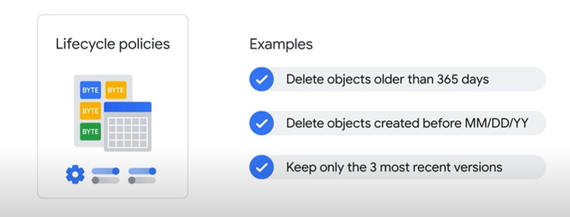

# Associate Cloud Engineer

## Google Cloud Fundamentals: Core Infrastructure

## 1º Módulo - Apresentação do Google Cloud

- Informações gerais da computação em nuvem
- IaaS - PaaS e SaaS
- Rede do Google Cloud
- Impacto ambiental
- Segurança
- Ecossistemas de código aberto
- Preços e faturamento

### Teste

1. Que tipo de serviço de computação em nuvem permite vincular o código do seu aplicativo a bibliotecas que dão acesso à infraestrutura de que o aplicativo precisa?

    :black_large_square: Infraestrutura como serviço

    :black_large_square: Nuvem híbrida

    :black_large_square: Software como serviço

    :black_large_square: Data centers virtualizados

    :white_check_mark: Plataforma como serviço

---

2. Para os clientes do Google Cloud, qual é o principal benefício de usar recursos em diversas zonas dentro de uma região?

    :white_check_mark: Melhorar a tolerância a falhas

    :black_large_square: Ampliar os serviços para clientes de novas áreas

    :black_large_square: Receber descontos em outras zonas

    :black_large_square: Melhorar o desempenho

---

3. Por que um cliente do Google Cloud usaria recursos em várias regiões do mundo?

    :white_check_mark: Para disponibilizar o aplicativo a usuários do mundo inteiro e melhorar a tolerância a falhas

    :black_large_square: Para melhorar a segurança

    :black_large_square: Para oferecer versões localizadas do aplicativo em diferentes regiões

    :black_large_square: Para receber descontos

---

## 2º Módulo - Recursos e acesso na nuvem

- Hierarquia de recursos do Google Cloud

- Identity and Access Management (IAM)

- Contas de serviço (Service Account)
- Cloud Identity
- Interação com o Google Cloud

- LAB: Noções básicas do Google Cloud: Introdução ao Cloud Marketplace

### Teste

1. Qual destes valores é globalmente exclusivo, permanente e imutável, mas pode ser modificado pelo cliente durante a criação?

    :white_check_mark: O ID do projeto

    :black_large_square: O número do cartão de crédito de faturamento do projeto

    :black_large_square: O número do projeto

    :black_large_square: O nome do projeto

---

2. Organize estes tipos de papéis do IAM do mais amplo ao mais detalhado.

    :white_check_mark: Papéis básicos, papéis predefinidos e papéis personalizados

    :black_large_square: Papéis predefinidos, papéis personalizados e papéis básicos

    :black_large_square: Papéis personalizados, papéis predefinidos e papéis básicos

---

3. Preencha a lacuna com a opção correta: Os serviços e as APIs são ativados por __________.

    :black_large_square: Organização

    :white_check_mark: Projeto

    :black_large_square: Contas de faturamento

    :black_large_square: Pasta

---

## 3º Módulo - Máquinas virtuais e redes na nuvem

- Redes de nuvem privada virtual (VPC)
- Compute Engine
    - Descontos de compute engine
    
- Escalonamento de máquinas virtuais
- Compatibilidades importantes com VPC
- Cloud Load Balancing
    - Tipos de Load Balancing
    
- Cloud DNS e Cloud CDN
- Como conectar redes à VPC do Google
    - Tipos de conexão entre redes Google
    
- LAB: Comece a usar a rede VPC e o Google Compute Engine

### Teste

1. Como usar o Cloud Load Balancing para balancear o tráfego HTTP?

    :black_large_square: Em várias instâncias de máquinas virtuais em uma única região do Compute Engine.

    :black_large_square: Em várias máquinas físicas de um único data center.

    :white_check_mark: Em várias regiões do Compute Engine.

    :black_large_square: Em vários serviços do Google Cloud Platform.

---

2. Qual é o principal motivo para os clientes escolherem VMs preemptivas?

    :black_large_square: Para reduzir os custos com sistemas operacionais premium.

    :white_check_mark: Para reduzir os custos.

    :black_large_square: Para melhorar o desempenho.

    :black_large_square: Para usar tipos de máquina personalizados.

---

3. Nas VPCs do Google Cloud, qual é o escopo das sub-redes?

    :white_check_mark: Regional

    :black_large_square: Zonal

    :black_large_square: Multirregional

    :black_large_square: Global

---

4. Para qual destas opções de interconexão existe um contrato de nível de serviço?

    :black_large_square: Nível de rede Standard

    :black_large_square: Peering por operadora

    :white_check_mark: Interconexão dedicada

    :black_large_square: Peering direto

---

## 4º Módulo - Armazenamento na nuvem

- Opções de armazenamento na nuvem

- Cloud Storage
    - Permissões em arquivos em um bucket
    
    - Politicas de ciclo de vida de um arquivo
    
- Cloud Storage: Classes de armazenamento e transferência de dados
    - Classes de armazenamento
    
    - Coisas em comum em todas as classes
    
- Cloud SQL
    - Principais caracteristicas do Cloud SQL
    
- Cloud Spanner
    - Principais caracteristicas
    
    
- Firestore
    - Caracteristicas
    
    - Cobrança
    
    - Cotas gratuitas
    
- Bigtable
    - Caracteristicas
    
    - Casos de uso
    
- Comparação entre as opções de armazenamento
    - Melhores usos para as opções de armazenamento no Google Cloud
    
- LAB: Noções básicas do Google Cloud - Como começar a usar o Cloud Storage e o Cloud SQL

### Teste

1. Qual é o caso de uso correto para o Cloud Storage?

    :black_large_square: O Cloud Storage é indicado para fornecer o sistema de arquivos raiz de uma máquina virtual com Linux.

    :white_check_mark: O Cloud Storage é adequado para fornecer armazenamento de objetos durável e altamente disponível.

    :black_large_square: O Cloud Storage é adequado para fornecer serviços de armazenamento em data warehouse.

    :black_large_square: O Cloud Storage é adequado para oferecer serviços RDBMS.

> O Cloud Storage é um armazenamento de objetos, e não de arquivos.

--- 

2. Por que um cliente consideraria a classe Coldline Storage?

    :black_large_square: Para melhorar a segurança.

    :black_large_square: Para reduzir custos com o armazenamento de dados acessados com frequência.

    :black_large_square: Para usar a API Coldline Storage.

    :white_check_mark: Para reduzir os custos com o armazenamento de dados acessados com pouca frequência.

> Os dados armazenados no Coldline são cobrados a uma taxa mensal baixa de armazenamento, embora uma tarifa seja aplicada nas recuperações.

---

3. Qual dos serviços a seguir pode ser escalonado para tamanhos maiores de banco de dados?

    :black_large_square: Firestore

    :black_large_square: Cloud Bigtable

    :white_check_mark: Cloud Spanner

    :black_large_square: Cloud SQL

> O Cloud Spanner pode ser escalonado para tamanhos de banco de dados de petabytes, enquanto o Cloud SQL é limitado pelo tamanho das instâncias de banco de dados que você escolhe. No momento em que este teste foi elaborado, o máximo era 10.230 GB.

---

## 5º Módulo - Contêineres na nuvem

- Introdução aos contêineres
- Kubernetes
- Google Kubernetes

### Teste

1. De onde vêm os recursos usados na criação de clusters do Google Kubernetes Engine?

    :black_large_square: Cloud Storage

    :black_large_square: Servidores bare metal

    :black_large_square: App Engine

    :white_check_mark: Compute Engine

> Como os recursos usados na criação de clusters do Google Kubernetes Engine são do Compute Engine, o Google Kubernetes Engine aproveita os recursos do Compute Engine e da VPC do Google.

---

2. O que é um pod do Kubernetes?

    :black_large_square: Um grupo de VMs

    :white_check_mark: Um grupo de contêineres

    :black_large_square: Um grupo de nós

    :black_large_square: Um grupo de clusters

>No Kubernetes, um grupo com um ou mais contêineres é chamado de pod. Os contêineres de um pod são implantados juntos. Eles são iniciados, interrompidos e replicados como um grupo.A carga de trabalho mais simples que o Kubernetes pode implantar é um pod com apenas um contêiner.

---

## 6º Módulo - Aplicativos no Google Cloud

- Cloud Run

- Desenvolvimento na nuvem
    - Cloud Functions
    
- LAB: Olá, Cloud Run

### Teste

1. Por que um cliente do Google Cloud escolheria usar o Cloud Functions?

    :black_large_square: O Cloud Functions é um serviço gratuito para hospedagem de operações de computação.

    :black_large_square: O aplicativo do cliente tem uma estrutura monolítica legada que ele quer dividir em microsserviços.

    :white_check_mark: O aplicativo dele contém código orientado a eventos e o cliente não quer provisionar recursos de computação para o app.

    :black_large_square: O Cloud Functions é a principal forma de executar aplicativos em C++ no Google Cloud.

---

2. Selecione a plataforma gerenciada de computação que executa contêineres sem estado usando solicitações da Web ou eventos do Pub/Sub.

    :black_large_square: Cloud Source Repositories

    :white_check_mark: Cloud Run

    :black_large_square: Gerenciamento de APIs da Apigee

    :black_large_square: Cloud Endpoints

---

3. O Cloud Run só pode extrair imagens de (selecione duas opções):

    :white_check_mark: Artifact Registry

    :black_large_square: GitHub

    :white_check_mark: Docker Hub

    :black_large_square: Cloud Storage

    :black_large_square: Registros auto-hospedados

---

## Resumo

- Resumo do curso