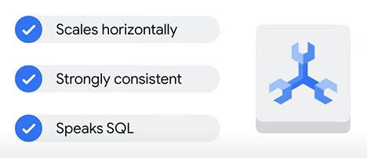

# Associate Cloud Engineer

## Google Cloud Fundamentals: Core Infrastructure

## 1º Módulo - Apresentação do Google Cloud

- Informações gerais da computação em nuvem
- IaaS - PaaS e SaaS
- Rede do Google Cloud
- Impacto ambiental
- Segurança
- Ecossistemas de código aberto
- Preços e faturamento

### Teste

1. Que tipo de serviço de computação em nuvem permite vincular o código do seu aplicativo a bibliotecas que dão acesso à infraestrutura de que o aplicativo precisa?

    :black_large_square: Infraestrutura como serviço

    :black_large_square: Nuvem híbrida

    :black_large_square: Software como serviço

    :black_large_square: Data centers virtualizados

    :white_check_mark: Plataforma como serviço

---

2. Para os clientes do Google Cloud, qual é o principal benefício de usar recursos em diversas zonas dentro de uma região?

    :white_check_mark: Melhorar a tolerância a falhas

    :black_large_square: Ampliar os serviços para clientes de novas áreas

    :black_large_square: Receber descontos em outras zonas

    :black_large_square: Melhorar o desempenho

---

3. Por que um cliente do Google Cloud usaria recursos em várias regiões do mundo?

    :white_check_mark: Para disponibilizar o aplicativo a usuários do mundo inteiro e melhorar a tolerância a falhas

    :black_large_square: Para melhorar a segurança

    :black_large_square: Para oferecer versões localizadas do aplicativo em diferentes regiões

    :black_large_square: Para receber descontos

---

## 2º Módulo - Recursos e acesso na nuvem

- Hierarquia de recursos do Google Cloud
    - 
- Identity and Access Management (IAM)
    - 
- Contas de serviço (Service Account)
- Cloud Identity
- Interação com o Google Cloud
    - 
- LAB: Noções básicas do Google Cloud: Introdução ao Cloud Marketplace

### Teste

1. Qual destes valores é globalmente exclusivo, permanente e imutável, mas pode ser modificado pelo cliente durante a criação?

    :white_check_mark: O ID do projeto

    :black_large_square: O número do cartão de crédito de faturamento do projeto

    :black_large_square: O número do projeto

    :black_large_square: O nome do projeto

---

2. Organize estes tipos de papéis do IAM do mais amplo ao mais detalhado.

    :white_check_mark: Papéis básicos, papéis predefinidos e papéis personalizados

    :black_large_square: Papéis predefinidos, papéis personalizados e papéis básicos

    :black_large_square: Papéis personalizados, papéis predefinidos e papéis básicos

---

3. Preencha a lacuna com a opção correta: Os serviços e as APIs são ativados por __________.

    :black_large_square: Organização

    :white_check_mark: Projeto

    :black_large_square: Contas de faturamento

    :black_large_square: Pasta

---

## 3º Módulo - Máquinas virtuais e redes na nuvem

- Redes de nuvem privada virtual (VPC)
- Compute Engine
    - Descontos de compute engine
        - 
- Escalonamento de máquinas virtuais
- Compatibilidades importantes com VPC
- Cloud Load Balancing
    - Tipos de Load Balancing
        - 
- Cloud DNS e Cloud CDN
- Como conectar redes à VPC do Google
    - Tipos de conexão entre redes Google
        - 
- LAB: Comece a usar a rede VPC e o Google Compute Engine

### Teste

1. Como usar o Cloud Load Balancing para balancear o tráfego HTTP?

    :black_large_square: Em várias instâncias de máquinas virtuais em uma única região do Compute Engine.

    :black_large_square: Em várias máquinas físicas de um único data center.

    :white_check_mark: Em várias regiões do Compute Engine.

    :black_large_square: Em vários serviços do Google Cloud Platform.

---

2. Qual é o principal motivo para os clientes escolherem VMs preemptivas?

    :black_large_square: Para reduzir os custos com sistemas operacionais premium.

    :white_check_mark: Para reduzir os custos.

    :black_large_square: Para melhorar o desempenho.

    :black_large_square: Para usar tipos de máquina personalizados.

---

3. Nas VPCs do Google Cloud, qual é o escopo das sub-redes?

    :white_check_mark: Regional

    :black_large_square: Zonal

    :black_large_square: Multirregional

    :black_large_square: Global

---

4. Para qual destas opções de interconexão existe um contrato de nível de serviço?

    :black_large_square: Nível de rede Standard

    :black_large_square: Peering por operadora

    :white_check_mark: Interconexão dedicada

    :black_large_square: Peering direto

---

## 4º Módulo - Armazenamento na nuvem

- Opções de armazenamento na nuvem
    - 
- Cloud Storage
    - Permissões em arquivos em um bucket
        - 
    - Politicas de ciclo de vida de um arquivo
        - 
- Cloud Storage: Classes de armazenamento e transferência de dados
    - Classes de armazenamento
        - 
    - Coisas em comum em todas as classes
        - 
- Cloud SQL
    - Principais caracteristicas do Cloud SQL
        - 
- Cloud Spanner
    - Principais caracteristicas
        - 
        - 
- Firestore
    - Caracteristicas
        - 
    - Cobrança
        - 
    - Cotas gratuitas
        - 
- Bigtable
    - Caracteristicas
        - 
    - Casos de uso
        - 
- Comparação entre as opções de armazenamento
    - Melhores usos para as opções de armazenamento no Google Cloud
        - 
- LAB: Noções básicas do Google Cloud - Como começar a usar o Cloud Storage e o Cloud SQL

### Teste

1. 