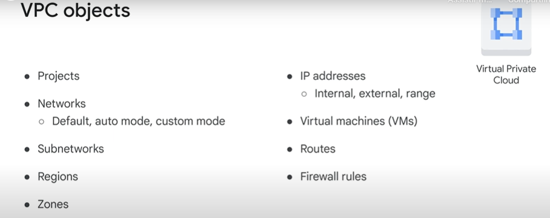
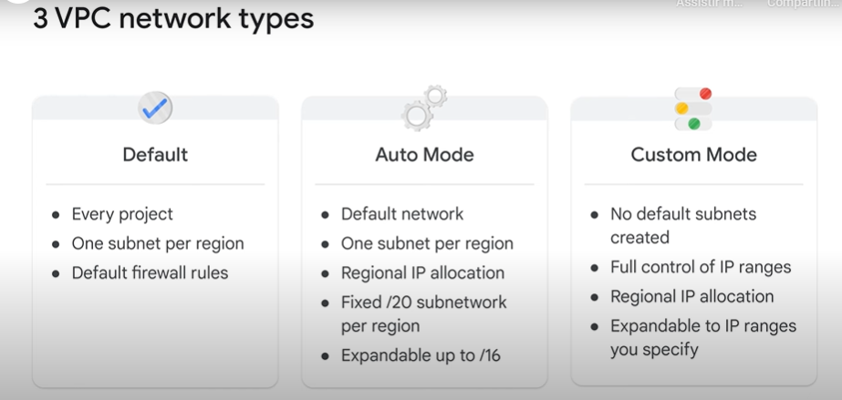
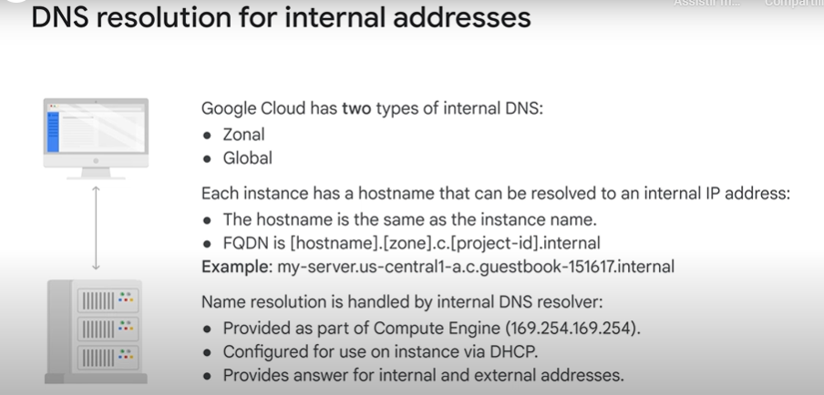
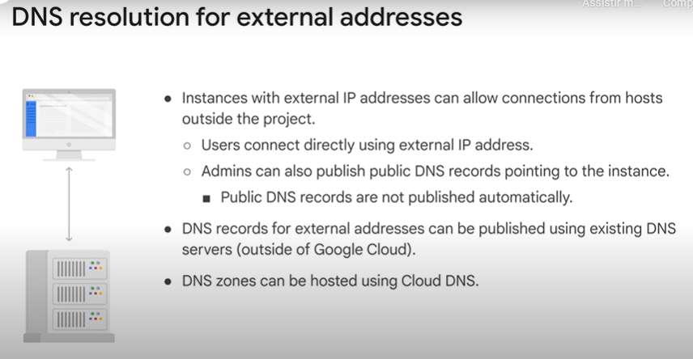

# Associate Cloud Engineer

## Essential Cloud Infrastructure: Foundation

## 1º Módulo - Interação com o Google Cloud

- Visão geral do módulo
- Como usar o Google Cloud
- Introdução ao laboratório - Como trabalhar com o console do Google Cloud e o Cloud Shell
- LAB: Como trabalhar com o console do Google Cloud e o Cloud Shell
    1. Acessando o Google Cloud;
    2. Usando o console do Google Cloud para criar um bucket do Cloud Storage;
    3. Usando o Cloud Shell para criar um bucket do Cloud Storage;
    4. Conhecendo os recursos do Cloud Shell.
        - O Cloud Shell oferece o seguinte:
            - VM temporária do Compute Engine
            - Acesso à instância via linha de comando usando um navegador
            - 5 GB de armazenamento em disco permanente (diretório $HOME)
            - Pré-instalação do SDK do Cloud e de outras ferramentas
            - gcloud: para trabalhar com o Compute Engine e vários serviços do Google Cloud
            - gcloud storage: para trabalhar com o Cloud Storage
            - kubectl: para trabalhar com o Google Kubernetes Engine e o Kubernetes
            - bq: para trabalhar com o BigQuery
            - Suporte para linguagens de programação Java, Go, Python, Node.js, PHP e Ruby
            - Recurso de visualização prévia na Web
            - Autorização integrada para acesso a recursos e instâncias
- Revisão do laboratório: Como trabalhar com o console do Google Cloud e o Cloud Shell
- Introdução ao laboratório: Visualização da Infraestrutura
- LAB: Visualização da infraestrutura
- Revisão do laboratório: Visualização de infraestrutura
- Demonstração: Projetos

## 2º Módulo - Redes Virtuais

- Visão geral do módulo
- Nuvem privada
    - Objetos de VPC
        - 
- Projetos, redes e sub-redes
    - Tipos de VPC
        - 
- Demonstração: expandir uma sub-rede
- Endereços IP
- Demonstração: IP interno e externo
- Como mapear endereços IP
    - DNS resolução de endereços internos
        - 
    - DNS resolução de endereços externos
        - 
- Endereços IP para domínios padrão
- Rotas e regras de Firewall
- Preços
- Introdução ao laboratório: Rede VPC
- LAB: Criação de redes VPC
- Revisão do laboratório: Rede VPC
- Designs de rede comuns
- 

### Questões

1. O Cloud Shell oferece qual das opções a seguir? (Selecione todas as opções aplicáveis).

    :white_check_mark: 5 GB de armazenamento persistente (/home)

    :white_check_mark: Autorização integrada para acesso a recursos e instâncias

    :white_check_mark: Acesso de linha de comando a uma VM temporária gratuita do Compute Engine

    :black_large_square: Uma ferramenta de linha de comando que exige a instalação do Cloud SDK

---

2. Para criar um estado persistente no Cloud Shell, qual arquivo você configuraria?

    :black_large_square: .my_variables

    :black_large_square: .bashrc

    :black_large_square: .config

    :white_check_mark: .perfil

---

3. O Google Cloud Marketplace permite implantar rapidamente pacotes de software funcionais, fornecendo modelos predefinidos com quais serviços do Google Cloud?

    :black_large_square: Terraform

    :black_large_square: Template Manager

    :black_large_square: Firestore

    :white_check_mark: Deployment Manager

---

4. Qual é a diferença entre o console do Google Cloud e o Cloud Shell?

    :black_large_square: O Cloud Shell é uma ferramenta instalada localmente e o console do Cloud é uma máquina virtual temporária.

    :black_large_square: Não há diferença entre as ferramentas, porque elas são 100% idênticas.

    :black_large_square: O console do Cloud é uma ferramenta de linha de comando e o Cloud Shell é uma interface gráfica do usuário

    :white_check_mark: O Cloud Shell é uma ferramenta de linha de comando e o console do Cloud é uma interface gráfica do usuário

> O console do Cloud é uma interface gráfica do usuário e o Cloud Shell é uma ferramenta de linha de comando. É possível interagir com o Google Cloud usando as duas ferramentas. Embora o console do Cloud realize tarefas que o Cloud Shell não realiza e vice-versa, não pense neles como alternativas, mas sim como uma só interface extremamente flexível e eficiente.

---

2. Qual dos recursos a seguir não permite que você interaja com o Google Cloud?

    :black_large_square: API baseada em REST

    :black_large_square: Cloud Shell

    :white_check_mark: Cloud Explorer

    :black_large_square: Console do Google Cloud

> Há quatro formas de interagir com o Google Cloud: o console do Cloud, o Cloud Shell e o SDK Cloud, além das APIs e do Cloud Mobile App. O Cloud Explorer não é uma ferramenta do Google Cloud.

---

