# Associate Cloud Engineer

## Essential Cloud Infrastructure: Foundation

## 1º Módulo - Interação com o Google Cloud

- Visão geral do módulo
- Como usar o Google Cloud
- Introdução ao laboratório - Como trabalhar com o console do Google Cloud e o Cloud Shell
- LAB: Como trabalhar com o console do Google Cloud e o Cloud Shell
    1. Acessando o Google Cloud;
    2. Usando o console do Google Cloud para criar um bucket do Cloud Storage;
    3. Usando o Cloud Shell para criar um bucket do Cloud Storage;
    4. Conhecendo os recursos do Cloud Shell.
        - O Cloud Shell oferece o seguinte:
            - VM temporária do Compute Engine
            - Acesso à instância via linha de comando usando um navegador
            - 5 GB de armazenamento em disco permanente (diretório $HOME)
            - Pré-instalação do SDK do Cloud e de outras ferramentas
            - gcloud: para trabalhar com o Compute Engine e vários serviços do Google Cloud
            - gcloud storage: para trabalhar com o Cloud Storage
            - kubectl: para trabalhar com o Google Kubernetes Engine e o Kubernetes
            - bq: para trabalhar com o BigQuery
            - Suporte para linguagens de programação Java, Go, Python, Node.js, PHP e Ruby
            - Recurso de visualização prévia na Web
            - Autorização integrada para acesso a recursos e instâncias
- Revisão do laboratório: Como trabalhar com o console do Google Cloud e o Cloud Shell
- Introdução ao laboratório: Visualização da Infraestrutura
- LAB: Visualização da infraestrutura
- Revisão do laboratório: Visualização de infraestrutura
- Demonstração: Projetos

## 2º Módulo - Redes Virtuais

- Visão geral do módulo
- Nuvem privada
    - Objetos de VPC
        - 
- Projetos, redes e sub-redes
    - Tipos de VPC
        - 
- Demonstração: expandir uma sub-rede
- Endereços IP
- Demonstração: IP interno e externo
- Como mapear endereços IP
    - DNS resolução de endereços internos
        - 
    - DNS resolução de endereços externos
        - 
- Endereços IP para domínios padrão
- Rotas e regras de Firewall
    - Tabela de roteamento simples
        - 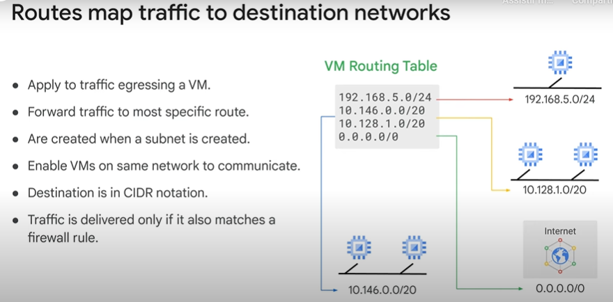
    - Regras de Firewall
        - 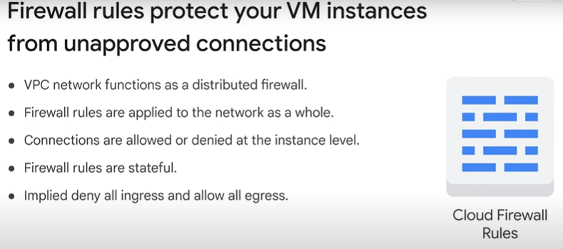
- Preços
- Introdução ao laboratório: Rede VPC
- LAB: Criação de redes VPC
- Revisão do laboratório: Rede VPC
- Designs de rede comuns
- Introdução ao LAB: Implementar acesso privado do Google e o Cloud NAT
- LAB: Implementar acesso privado do Google e o Cloud NAT
- Revisão do LAB: Implementar acesso privado do Google e o Cloud NAT

## 3º Módulo - Compute Engine

- Visão geral do módulo
- Compute Engine
    - Informações
        - 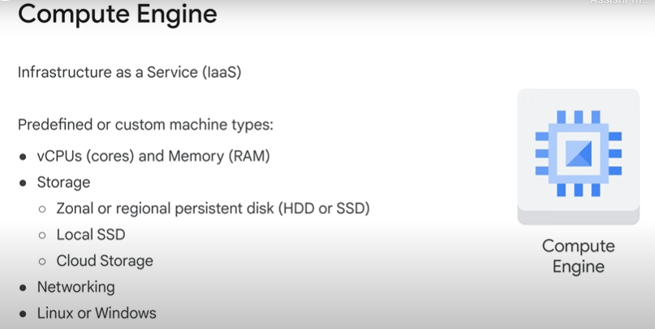
    - Tipo de máquina
        - 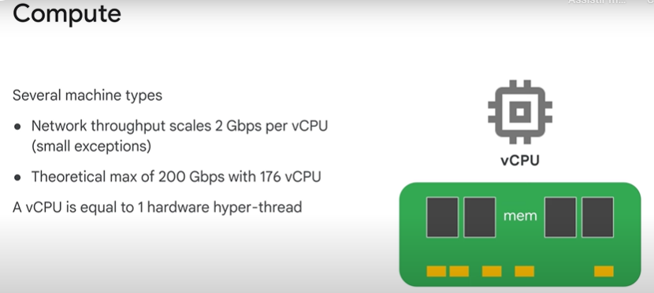
    - Storage
        - 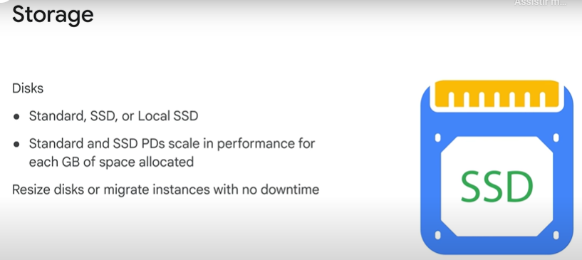
- Demo: Criar uma VM
- Acesso e ciclo de vida da VM
    - Ciclo de vida
        - 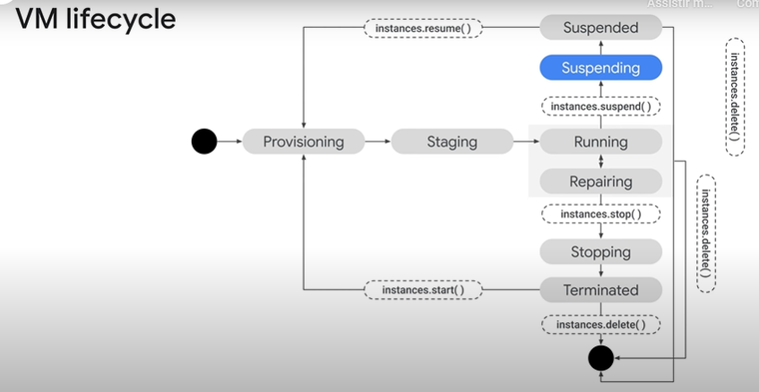
    - Patch Management
        - 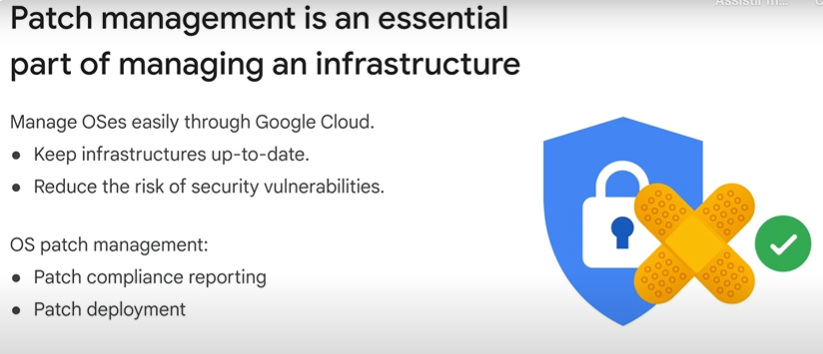
- Intro ao LAB: Como criar máquinas virtuais
- LAB: Como criar máquinas virtuais
- Revisão do LAB: Como criar máquinas virtuais
- Opções de computação
    - Familias de máquinas
        - 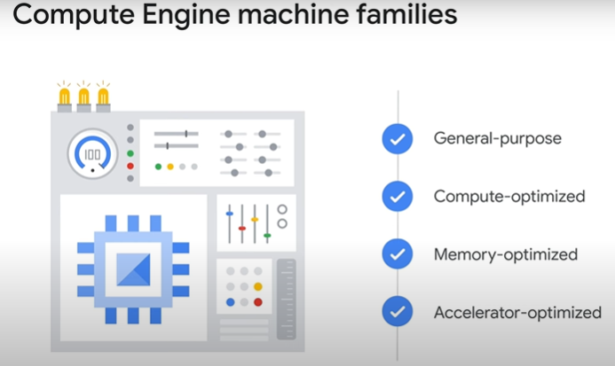
- Preços do Compute Engine
- Configurações especiais do Compute Engine
- Imagens
    - O que é uma imagem?
        - 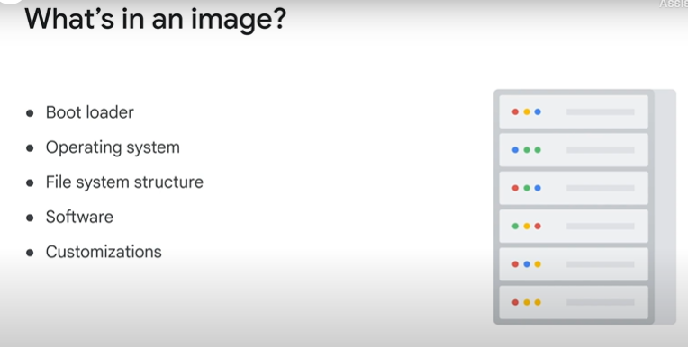
- Opções de disco
- Ações comuns do Compute Engine
    - Movendo instâncias para outra Zona
        - 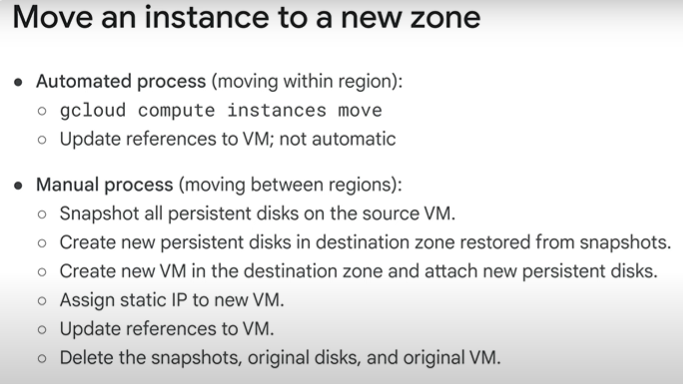
    - Snapshots de discos permanentes
        - 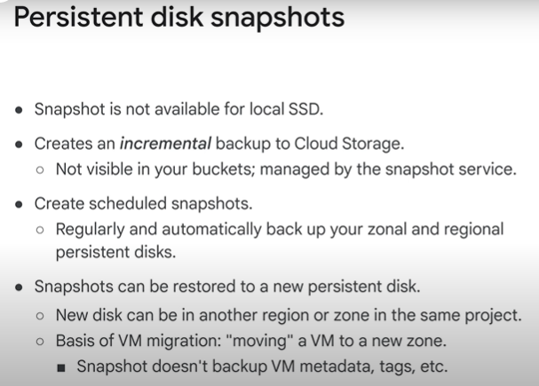
- Intro ao LAB: Como trabalhar com máquinas virtuais
- LAB: Como trabalhar com máquinas virtuais
- Revisão do LAB: Como trabalhar com máquinas virtuais
- Revisão do módulo

### Questões

1. O Cloud Shell oferece qual das opções a seguir? (Selecione todas as opções aplicáveis).

    :white_check_mark: 5 GB de armazenamento persistente (/home)

    :white_check_mark: Autorização integrada para acesso a recursos e instâncias

    :white_check_mark: Acesso de linha de comando a uma VM temporária gratuita do Compute Engine

    :black_large_square: Uma ferramenta de linha de comando que exige a instalação do Cloud SDK

---

2. Para criar um estado persistente no Cloud Shell, qual arquivo você configuraria?

    :black_large_square: .my_variables

    :black_large_square: .bashrc

    :black_large_square: .config

    :white_check_mark: .perfil

---

3. O Google Cloud Marketplace permite implantar rapidamente pacotes de software funcionais, fornecendo modelos predefinidos com quais serviços do Google Cloud?

    :black_large_square: Terraform

    :black_large_square: Template Manager

    :black_large_square: Firestore

    :white_check_mark: Deployment Manager

---

4. Qual é a diferença entre o console do Google Cloud e o Cloud Shell?

    :black_large_square: O Cloud Shell é uma ferramenta instalada localmente e o console do Cloud é uma máquina virtual temporária.

    :black_large_square: Não há diferença entre as ferramentas, porque elas são 100% idênticas.

    :black_large_square: O console do Cloud é uma ferramenta de linha de comando e o Cloud Shell é uma interface gráfica do usuário

    :white_check_mark: O Cloud Shell é uma ferramenta de linha de comando e o console do Cloud é uma interface gráfica do usuário

> O console do Cloud é uma interface gráfica do usuário e o Cloud Shell é uma ferramenta de linha de comando. É possível interagir com o Google Cloud usando as duas ferramentas. Embora o console do Cloud realize tarefas que o Cloud Shell não realiza e vice-versa, não pense neles como alternativas, mas sim como uma só interface extremamente flexível e eficiente.

---

5. Qual dos recursos a seguir não permite que você interaja com o Google Cloud?

    :black_large_square: API baseada em REST

    :black_large_square: Cloud Shell

    :white_check_mark: Cloud Explorer

    :black_large_square: Console do Google Cloud

> Há quatro formas de interagir com o Google Cloud: o console do Cloud, o Cloud Shell e o SDK Cloud, além das APIs e do Cloud Mobile App. O Cloud Explorer não é uma ferramenta do Google Cloud.

---

6. Quais são os três tipos de redes disponíveis no Google Cloud?

    :black_large_square: Zonal, regional e global

    :black_large_square: Redes de 1 gigabit, 10 gigabits e 100 gigabits

    :black_large_square: Unicast IPv4, multicast IPv4 e IPv6

    :white_check_mark: Padrão, automática e personalizada.

> O Google Cloud oferece três tipos de rede: padrão, automática e personalizada. Todo projeto começa com uma rede padrão. A rede automática usa os mesmos intervalos de IP de sub-rede que a padrão, com outro nome de rede. Com a personalizada, é possível especificar os intervalos de IP das sub-redes.

---

7. Qual a vantagem de aplicar regras de firewall por tag em vez de por endereço?

    :black_large_square: As tags no tráfego de rede ajudam na detecção de redes.

    :black_large_square: As tags nas regras de firewall controlam quais endereços IP temporários as VMs vão receber.

    :black_large_square: As tags ajudam as organizações a acompanhar o faturamento do firewall.

    :white_check_mark: Quando uma VM é criada com uma tag correspondente, as regras de firewall são aplicadas seja qual for o endereço IP atribuído.

> Quando uma VM é criada, o endereço IP externo temporário é atribuído a partir de um pool. Não há como prever qual endereço será atribuído, portanto, não há como gravar uma regra que corresponda ao endereço IP dessa máquina antes que ela seja atribuída. As tags permitem uma atribuição simbólica que não depende da ordem dos endereços IP. As regras de firewall ficam mais simples, gerais e fáceis de manter.

8. No Google Cloud, qual é o número mínimo de endereços IP necessários para uma instância de VM?

    :black_large_square: Três: um endereço IP interno, um externo e um do alias

    :black_large_square: Dois: um endereço IP interno e outro externo

    :white_check_mark: Um: apenas um endereço IP interno

> No Google Cloud, cada máquina virtual precisa ter um endereço IP interno. O endereço IP externo é opcional; portanto, uma instância de VM precisa apenas de um endereço IP.

---

9. Qual das afirmações sobre as instâncias de máquinas virtuais no Compute Engine é verdadeira?

    :white_check_mark: No Compute Engine, uma VM é um serviço em rede que simula os recursos de um computador.

    :black_large_square: Todas as VMs do Compute Engine são de locação única e não compartilham o hardware da CPU.

    :black_large_square: Uma VM no Compute Engine sempre é associada a um único computador de hardware em um rack.

    :black_large_square: O Compute Engine usa o VMware para criar instâncias de máquina virtual.

> As VMs são um conjunto de serviços de rede no Compute Engine que incluem discos permanentes conectados à rede. Em alguns casos, a VM do Google Cloud se comporta de maneira diferente de hardwares ou de outros tipos de máquinas virtuais. Por exemplo, quando uma CPU virtual com vários locatários sofre bursts, excedendo a capacidade além das especificações da VM.

---

10. Qual afirmação sobre os discos permanentes é verdadeira?

    :black_large_square: Os discos permanentes são sempre HDDs (discos giratórios magnéticos).

    :white_check_mark: Os discos permanentes são criptografados por padrão.

    :black_large_square: Os discos permanentes são dispositivos físicos de hardware conectados diretamente às VMs.

    :black_large_square: Um disco permanente não pode ser redimensionado depois de criado.

> Os discos permanentes não são físicos, eles são um serviço de rede virtual. Cada disco permanente fica criptografado com chaves definidas pelo sistema ou fornecidas pelo cliente.

---

11. O que são descontos por uso prolongado?

    :black_large_square: Faturamento por segundo que inicia após o período mínimo de um minuto

    :white_check_mark: Descontos automáticos que você adquire por executar recursos específicos do Compute Engine por um período relevante do mês de faturamento

    :black_large_square: Compromissos de compra para recursos específicos que você sabe que vai usar

    :black_large_square: Descontos que você recebe por usar instâncias de VM preemptiva

> Descontos por uso prolongado são benefícios automáticos recebidos pela execução de recursos específicos do Compute Engine (vCPUs, memória, dispositivos de GPU) por uma grande parte do mês de faturamento. Para usar o desconto total de 30%, você precisa criar as instâncias de VM no primeiro dia do mês, porque os descontos são redefinidos no início de cada mês.