# Associate Cloud Engineer

## Elastic Google Cloud Infrastructure: Scaling and Automation

## 1º Módulo - Interconexão de rede

- Cloud VPN
- Intro ao LAB: Como configurar a VPN de alta disponibilidade do Google Cloud
- LAB: Como configurar a VPN de alta disponibilidade do Google Cloud
    - Simulação
        - 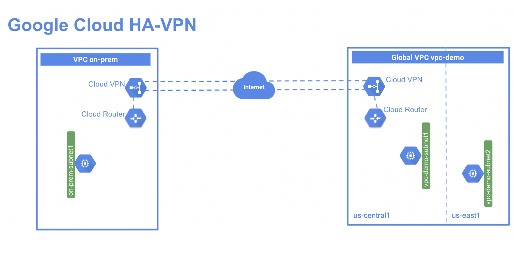
    - Comando Cloud Shell utilizados no laboratório
        - Criando um VPC no modo custom
            - `gcloud compute networks create vpc-demo --subnet-mode custom`
            - `gcloud compute networks create on-prem --subnet-mode custom`
        - Criando uma subnet na VPC existente
            - `gcloud compute networks subnets create vpc-demo-subnet1 --network vpc-demo --range 10.1.1.0/24 --region "REGION"`
            - `gcloud compute networks subnets create vpc-demo-subnet2 --network vpc-demo --range 10.2.1.0/24 --region "REGION 2"`
            - `gcloud compute networks subnets create on-prem-subnet1 --network on-prem --range 192.168.1.0/24 --region "REGION"`
        - Criando regras de Firewall
            - `gcloud compute firewall-rules create vpc-demo-allow-custom --network vpc-demo --allow tcp:0-65535,udp:0-65535,icmp --source-ranges 10.0.0.0/8`
            - `gcloud compute firewall-rules create on-prem-allow-custom --network on-prem --allow tcp:0-65535,udp:0-65535,icmp --source-ranges 192.168.0.0/16`
            - `gcloud compute firewall-rules create vpc-demo-allow-ssh-icmp --network vpc-demo --allow tcp:22,icmp`
            - `gcloud compute firewall-rules create on-prem-allow-ssh-icmp --network on-prem --allow tcp:22,icmp`
        - Criando uma instância em uma das Zonas existentes
            - `gcloud compute instances create vpc-demo-instance1 --machine-type=e2-medium --zone "ZONE" --subnet vpc-demo-subnet1`
            - `gcloud compute instances create vpc-demo-instance2 --machine-type=e2-medium --zone ZONE2 --subnet vpc-demo-subnet2`
            - `gcloud compute instances create on-prem-instance1 --machine-type=e2-medium --zone "zone_name" --subnet on-prem-subnet1`
        - Criando VPN HA
            - `gcloud compute vpn-gateways create vpc-demo-vpn-gw1 --network vpc-demo --region "REGION"`
            - `gcloud compute vpn-gateways create on-prem-vpn-gw1 --network on-prem --region "REGION"`
        - Verificando os Gateways VPN criados
            - `gcloud compute vpn-gateways describe vpc-demo-vpn-gw1 --region "REGION"`
            - `gcloud compute vpn-gateways describe on-prem-vpn-gw1 --region "Region"`
        - Criando um Cloud Router
            - `gcloud compute routers create vpc-demo-router1 --region "REGION" --network vpc-demo --asn 65001`
            - `gcloud compute routers create on-prem-router1 --region "REGION" --network on-prem --asn 65002`
        - Criando os Túneis de VPN
            - `gcloud compute vpn-tunnels create vpc-demo-tunnel0 --peer-gcp-gateway on-prem-vpn-gw1 --region "REGION" --ike-version 2 --shared-secret [SHARED_SECRET] --router vpc-demo-router1 --vpn-gateway vpc-demo-vpn-gw1 --interface 0`
            - `gcloud compute vpn-tunnels create vpc-demo-tunnel1 --peer-gcp-gateway on-prem-vpn-gw1 --region "REGION" --ike-version 2 --shared-secret [SHARED_SECRET] --router vpc-demo-router1 --vpn-gateway vpc-demo-vpn-gw1 --interface 1`
            - `gcloud compute vpn-tunnels create on-prem-tunnel0 --peer-gcp-gateway vpc-demo-vpn-gw1 --region "REGION" --ike-version 2 --shared-secret [SHARED_SECRET] --router on-prem-router1 --vpn-gateway on-prem-vpn-gw1 --interface 0`
            - `gcloud compute vpn-tunnels create on-prem-tunnel1 --peer-gcp-gateway vpc-demo-vpn-gw1 --region "REGION" --ike-version 2 --shared-secret [SHARED_SECRET] --router on-prem-router1 --vpn-gateway on-prem-vpn-gw1 --interface 1`
        - Criando interface para o Cloud Router
            - `gcloud compute routers add-interface vpc-demo-router1 --interface-name if-tunnel0-to-on-prem     --ip-address 169.254.0.1 --mask-length 30 --vpn-tunnel vpc-demo-tunnel0 --region "REGION"`
            - `gcloud compute routers add-interface vpc-demo-router1 --interface-name if-tunnel1-to-on-prem     --ip-address 169.254.1.1 --mask-length 30 --vpn-tunnel vpc-demo-tunnel1 --region "REGION"`
            - `gcloud compute routers add-interface on-prem-router1 --interface-name if-tunnel0-to-vpc-demo     --ip-address 169.254.0.2 --mask-length 30 --vpn-tunnel on-prem-tunnel0 --region "REGION"`
            - `gcloud compute routers add-interface  on-prem-router1 --interface-name if-tunnel1-to-vpc-demo     --ip-address 169.254.1.2 --mask-length 30 --vpn-tunnel on-prem-tunnel1 --region "REGION"`
        - Criando o peering BGP
            - `gcloud compute routers add-bgp-peer vpc-demo-router1 --peer-name bgp-on-prem-tunnel0 --interface if-tunnel0-to-on-prem --peer-ip-address 169.254.0.2 --peer-asn 65002 --region "REGION"`
            - `gcloud compute routers add-bgp-peer vpc-demo-router1 --peer-name bgp-on-prem-tunnel1 --interface if-tunnel1-to-on-prem --peer-ip-address 169.254.1.2 --peer-asn 65002 --region "REGION"`
            - `gcloud compute routers add-bgp-peer on-prem-router1 --peer-name bgp-vpc-demo-tunnel0 --interface if-tunnel0-to-vpc-demo --peer-ip-address 169.254.0.1 --peer-asn 65001 --region "REGION"`
            - `gcloud compute routers add-bgp-peer  on-prem-router1 --peer-name bgp-vpc-demo-tunnel1 --interface if-tunnel1-to-vpc-demo --peer-ip-address 169.254.1.1 --peer-asn 65001 --region "REGION"`
        - Verificando as confs do Cloud Router
            - `gcloud compute routers describe vpc-demo-router1 --region "REGION"`
            - `gcloud compute routers describe on-prem-router1 --region "REGION"`
        - Regras de Firewall para comunicação entre as redes "on-prem" e "vpc-demo"
            - `gcloud compute firewall-rules create vpc-demo-allow-subnets-from-on-prem --network vpc-demo     --allow tcp,udp,icmp --source-ranges 192.168.1.0/24`
            - `gcloud compute firewall-rules create on-prem-allow-subnets-from-vpc-demo --network on-prem     --allow tcp,udp,icmp --source-ranges 10.1.1.0/24,10.2.1.0/24`
        - Verificando status dos Túneis de VPN
            - `gcloud compute vpn-tunnels list`
            - `gcloud compute vpn-tunnels describe vpc-demo-tunnel0 --region "REGION"`
            - `gcloud compute vpn-tunnels describe vpc-demo-tunnel1 --region "REGION"`
            - `gcloud compute vpn-tunnels describe on-prem-tunnel0 --region "REGION"`
            - `gcloud compute vpn-tunnels describe on-prem-tunnel1 --region "REGION"`
        - Alterar o roteamento BGP para o modo GLOBAL
            - `gcloud compute networks update vpc-demo --bgp-routing-mode GLOBAL`
        - Verificando mudança no roteamento
            - `gcloud compute networks describe vpc-demo`
- Cloud Interconnect e Peering
- Cloud Interconnect
    - Localização de colocations para realização do Interconnect Dedicada (Direto ou por parceiro)
        - 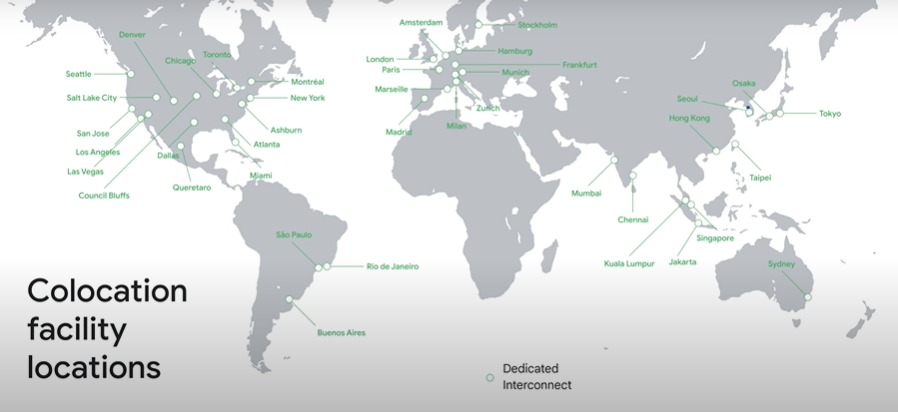
- Peering
- Como escolher uma conexão
    - 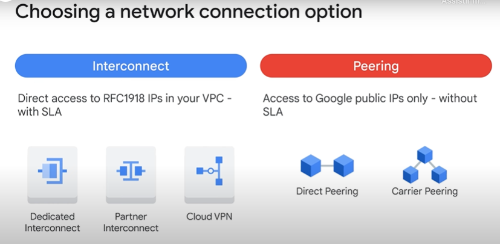
- VPC compartilhada e peering VPC
    - Shared VPC Vs. VPC Peering
        - 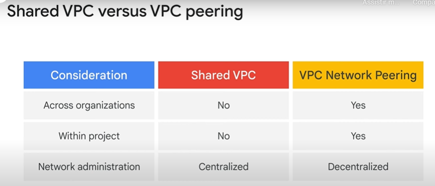
- Revisão

## 2º Módulo - Balanceamento de carga e escalonamento automático

- Visão geral do módulo
- Grupos gerenciados de instâncias
- Escalonamento automático e verificações de integridade
- Visão geral do balanceamento de carga HTTPS
    - LB HTTP(S)
        - 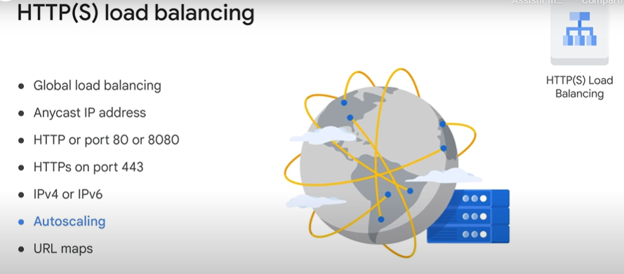
- Ex: Balanceador de carga HTTP
- Balancemanento de carga HTTPS
    - Certificados SSL
        - 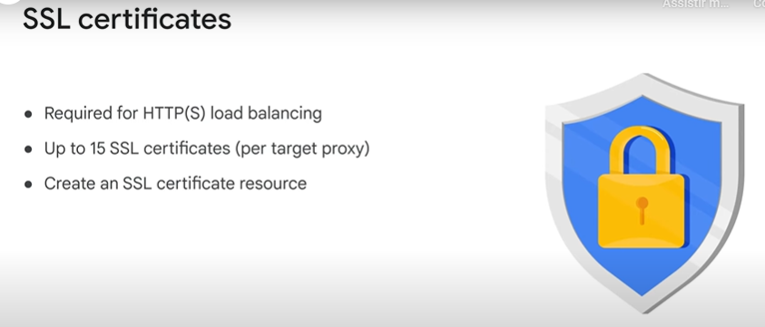
    - NEG - Network endpoint groups
        - 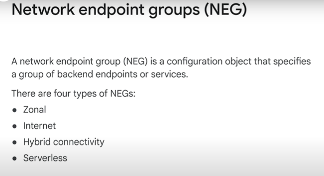
- Intro ao LAB: Como configurar um balanceador de carga HTTP com escalonamento automático
- LAB: Como configurar um balanceador de carga HTTP com escalonamento automático
- Revisão LAB: Como configurar um balanceador de carga HTTP com escalonamento automático
- Cloud CDN
    - Modos de cache
        - 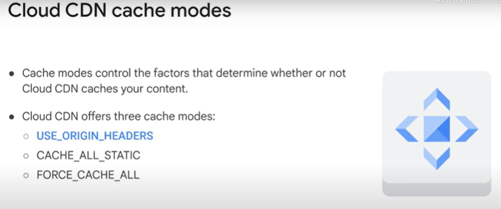
- Balanceamento de carga de proxy SSL
    - SSL Proxy LB
        - 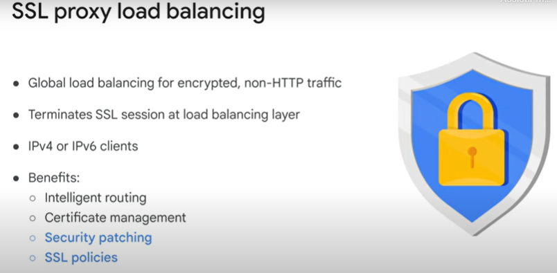
- Balanceamento de carga de proxy TCP
- Balanceamento de carga de rede
- Balanceamento de carga interno
- Intro ao LAB: Como configurar um balanceador de carga interno
- LAB: Como configurar um balanceador de carga interno
    - Configurações importantes realizadas no LAB de LB
        - Configurando tráfedo entre subnets
            - 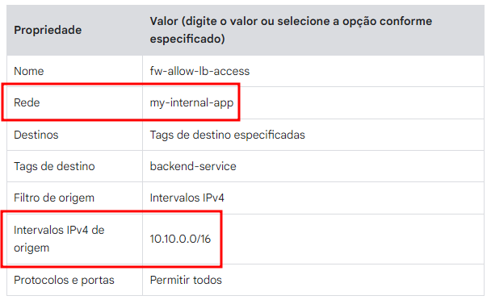
        - Regras de Firewall de Health Check
            - 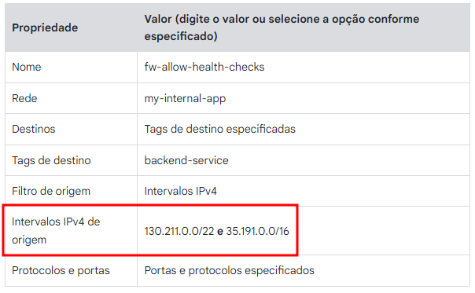
- Revisão LAB: Como configurar um balanceador de carga interno
- Como escolher um balanceador de carga
    - Balanceadores permitem tráfego IPv6 e possuem proxy reverso para tradução para IPv4.
        - 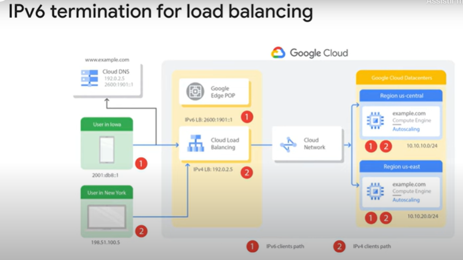
    - Sumário de Load Balancers
        - 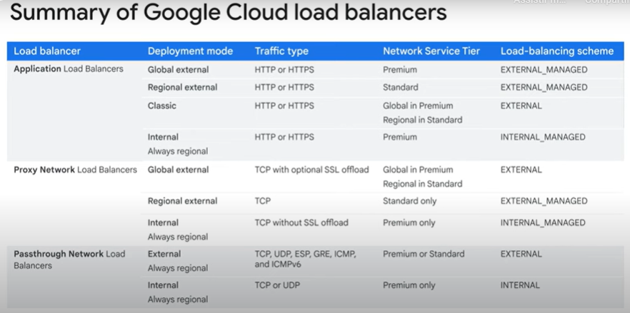

## 3º módulo - Automatização de infraestrutura

- Visão geral do módulo
- Terraform
- Intro ao LAB: Como automatizar a infraestrutura de redes usando terraform
- LAB: Como automatizar a infraestrutura de redes usando terraform
    - Arquivos de configuração terraform adicionados a uma subpasta.
- Revisão do LAB: Como automatizar a infraestrutura de redes usando terraform
- Google Cloud Marketplace
- Demo: Lançamento de soluções de infraestrutura no Google Cloud Marketplace

## 4º módulo - Serviços gerenciados

- Visão geral do módulo
- Bigquery
- Dataflow
    - 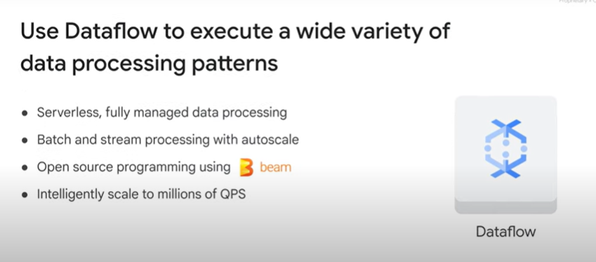
- Dataprep
    - 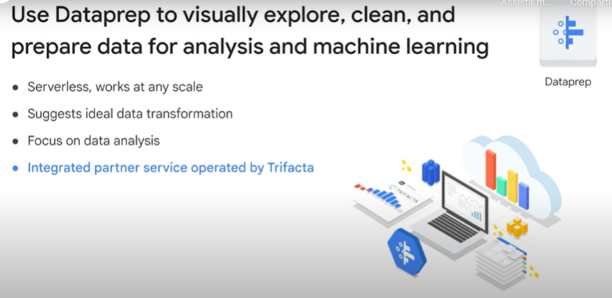
- Dataproc
    - 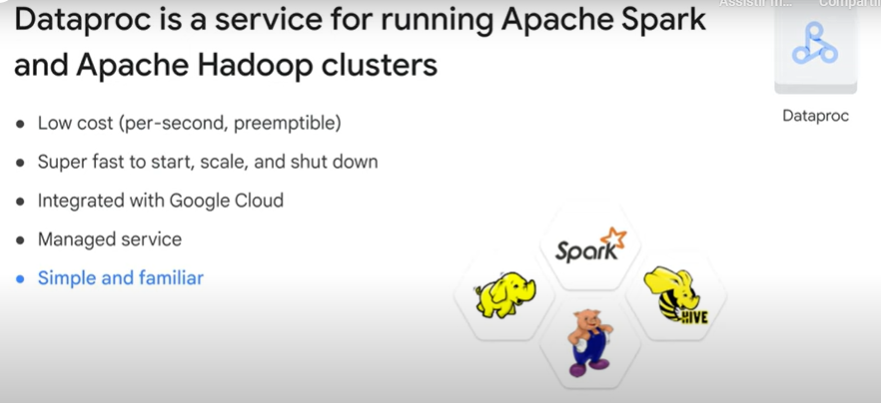
- Demo: Dataproc

### Questões

1. Qual serviço do Google Cloud Interconnect requer conexão em uma instalação de colocation do Google Cloud e fornece 10 Gbps por link?

    :black_large_square: Peering direto

    :black_large_square: Interconexão por parceiro

    :white_check_mark: Interconexão dedicada

    :black_large_square: Peering por operadora

    :black_large_square: Cloud VPN

> A Interconexão dedicada requer uma conexão em uma instalação de colocation do Google Cloud e fornece 10 Gbps por link.

---

2. Quando não é possível atender aos requisitos de peering do Google, qual serviço de conexão de rede você pode escolher para se conectar ao Google Workspace e ao YouTube?

    :black_large_square: Interconexão dedicada

    :black_large_square: Peering direto

    :black_large_square: Interconexão por parceiro

    :white_check_mark: Peering por operadora

> O peering por operadora permite que você se conecte ao Google Workspace e ao YouTube sem atender aos requisitos de peering do Google.

---

3. Qual das seguintes abordagens para uma rede de vários projetos usa um modelo de administração de rede centralizada?

    :white_check_mark: VPC compartilhada

    :black_large_square: Cloud VPN

    :black_large_square: Peering de rede VPC

> A VPC compartilhada é uma abordagem centralizada a uma rede de vários projetos porque a política de segurança e rede é aplicada em uma única rede VPC designada.

---

4. Qual é a finalidade de uma rede privada virtual (VPN)?

    :black_large_square: O objetivo principal é criptografar dados para que sejam armazenados em um formato criptografado.

    :black_large_square: Limitar o acesso à rede: as VPNs também são conhecidas como listas de controle de acesso (ACLs).

    :white_check_mark: Oferecer um método de comunicação seguro (um túnel) para conectar dois ambientes confiáveis em um ambiente não confiável, como a Internet.

    :black_large_square: Oferecer um método para detectar invasores na borda de um limite de rede.

> As VPNs usam túneis IPsec para oferecer um caminho encapsulado e criptografado em um ambiente hostil ou não confiável.

---

5. Quais são os três serviços de balanceamento de carga do Google Cloud que oferecem suporte a clientes IPv6?

    :black_large_square: Balanceamento de carga de rede

    :black_large_square: Balanceamento de carga interno

    :white_check_mark: Balanceamento de carga HTTP(S)

    :white_check_mark: Balanceamento de carga de proxy TCP

    :white_check_mark: Balanceamento de carga de proxy SSL

---

6. Quais das opções a seguir são políticas de escalonamento automático aplicáveis a grupos gerenciados de instâncias?

    :white_check_mark: Métricas do Monitoring

    :white_check_mark: Capacidade do balanceamento de carga

    :white_check_mark: Utilização de CPU

    :white_check_mark: Cargas de trabalho baseadas em filas

---

7. Qual das opções a seguir não é um serviço de balanceamento de carga do Google Cloud?

    :black_large_square: Balanceamento de carga de rede

    :black_large_square: Balanceamento de carga de proxy TCP

    :black_large_square: Balanceamento de carga HTTP(S)

    :white_check_mark: Balanceamento de carga definido por hardware

    :black_large_square: Balanceamento de carga interno

    :black_large_square: Balanceamento de carga de proxy SSL

---

8. O que o Google Cloud Marketplace oferece?

    :black_large_square: Uma plataforma de faturamento centralizada para todos os serviços e aplicativos do Google Cloud

    :white_check_mark: Soluções para produção de outros fornecedores que já criaram as próprias configurações de implantação com o Terraform

    :black_large_square: Uma plataforma para comercializar instâncias de VM

---

9. Qual é o benefício de escrever modelos para sua configuração do Terraform?

    :black_large_square: Permite fixar no código as propriedades dos recursos

    :white_check_mark: Permite que você abstraia parte da configuração em elementos básicos individuais que podem ser reutilizados.

    :black_large_square: Ele permite que você execute o software de gerenciamento de configurações.

---

10. Qual das seguintes afirmações sobre o Dataproc é verdadeira?

    :black_large_square: Com o Dataproc, é possível ter o controle total sobre as configurações avançadas do HDFS.

    :white_check_mark: Geralmente ele leva menos de 90 segundos para iniciar um cluster.

    :black_large_square: O faturamento do Dataproc é feito em intervalos de 10 horas.

    :black_large_square:Ele não se integra ao Cloud Monitoring, mas tem o próprio sistema de monitoramento.

    > Ele inicia um cluster com rapidez.

11. Como os serviços gerenciados podem ser úteis?

    :black_large_square: Os serviços gerenciados são serviços pagos oferecidos por fornecedores terceirizados.

    :black_large_square: Os serviços gerenciados são mais personalizáveis que as soluções de infraestrutura.

    :white_check_mark: O Google vai cuidar do gerenciamento do seu serviço de infraestrutura se você assinar um contrato de serviços gerenciados.

    :black_large_square: Os serviços gerenciados podem ser uma alternativa à criação e ao gerenciamento de soluções de infraestrutura.

    > Os serviços gerenciados são apresentados como uma alternativa à criação de uma solução própria de processamento de dados de infraestrutura.

---