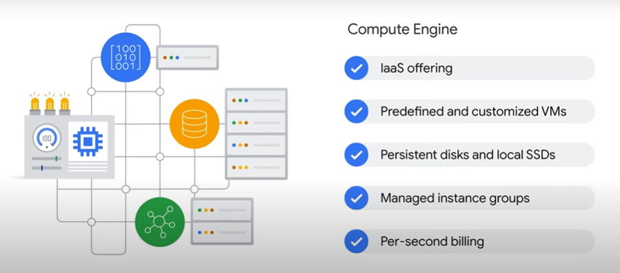
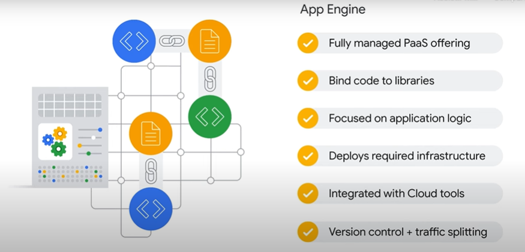
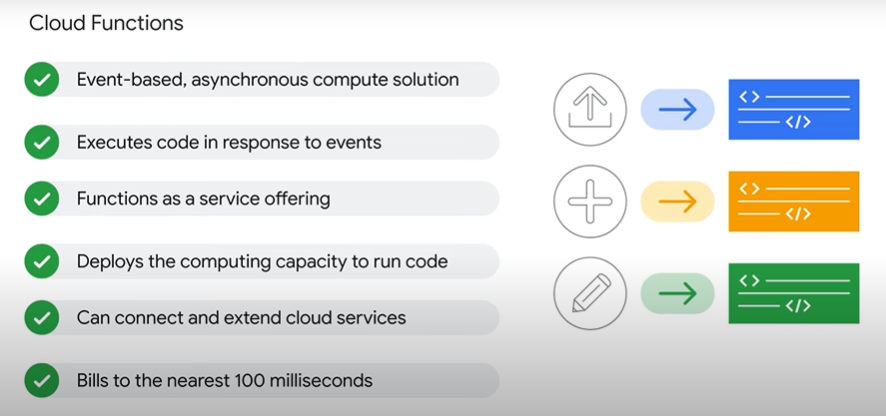
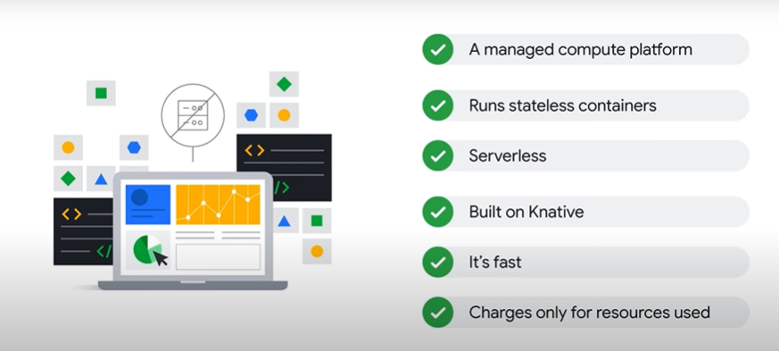
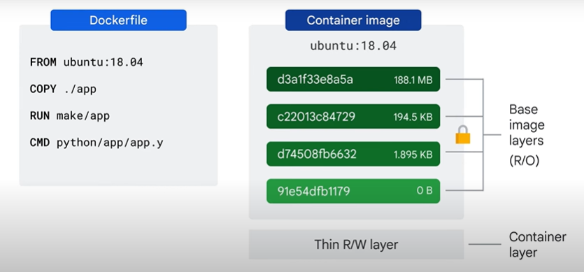

# Associate Cloud Engineer

## Getting Started with Google Kubernetes Engine"

## 1º Módulo - Introdução ao Google Cloud

- Introdução
- A computação em nuvem e o Google Cloud
- Soluções de computação do Google Cloud
    - Compute Engine
    
    - GKE
    
    - App Engine
    
    - Cloud Functions
    
    - Cloud Run
    
- A rede do Google
- Gerenciamento de recursos
- Faturamento
- Interação com o Google Cloud
- Intro ao LAB: Como acessar o console do Cloud e o Cloud Shell
- LAB: Como acessar o console do Cloud e o Cloud Shell

## Introdução aos contêineres e ao Kubernetes

- Introdução
- Contêineres
- Imagens do contêiner

- Intro ao LAB: Como trabalhar com o Cloud Build
- LAB: Como trabalhar com o Cloud Build
    - Comandos do lab
        - `gcloud artifacts repositories create quickstart-docker-repo --repository-format=docker --location="REGION" --description="Docker repository"`
        - `gcloud builds submit --tag "REGION"-docker.pkg.dev/${DEVSHELL_PROJECT_ID}/quickstart-docker-repo/quickstart-image:tag1`
        - `gcloud builds submit --config cloudbuild.yaml`
- Kubernetes
- Google Kubernetes Engine

### Questões

1. Você está pensando em implantar uma solução usando contêineres no Google Cloud. Qual solução do Google Cloud oferece uma plataforma de computação gerenciada com suporte nativo para contêineres?

    :black_large_square: Container Registry

    :black_large_square: Cloud Functions

    :black_large_square: Grupos de escalonamento automático do Compute Engine

    :white_check_mark: Clusters do Google Kubernetes Engine

---

2. Uma das características principais da computação em nuvem é a elasticidade dos recursos. O que isso significa?

    :black_large_square: Você consegue mais recursos rapidamente quando precisa.

    :white_check_mark: Os clientes conseguem mais recursos quando precisam. Se precisarem de menos recursos, podem reduzir o escalonamento.

    :black_large_square: Você compartilha recursos de um grande pool que permite economizar no escalonamento.

    :black_large_square: Alocação automática de recursos.

---

3. Qual é a melhor estrutura da hierarquia do Identity and Access Management (IAM) para criação de um aplicativo no Google Cloud?

    :black_large_square: Criar projetos para cada um dos aplicativos dos componentes e adicionar pastas a eles para os recursos.

    :white_check_mark: Criar uma pasta no nó da sua organização e adicionar projetos a ela para os recursos.

    :black_large_square: Criar um nó da organização para o projeto e criar todos os projetos e recursos dentro dele.

    :black_large_square: Criar projetos e recursos dentro de pastas departamentais para os recursos necessários, organizados por aplicativos dos componentes.

---

4. Você está desenvolvendo um novo produto para um cliente e precisa ter cuidado com o custo e os recursos. Quais ferramentas do Google Cloud podem ser usadas para garantir que os custos continuem gerenciáveis antes do consumo se tornar muito alto?

Configurar a conta de faturamento no nível das pastas dos produtos na hierarquia dos recursos.

Configurar a conta de faturamento de cada projeto associado ao produto.

    :white_check_mark: Configurar orçamentos e alertas para envolvidos no projeto.

Configurar cotas e limites para cada pasta de produto.
