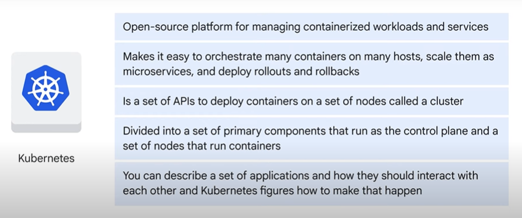
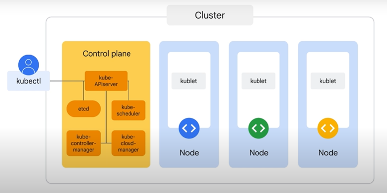

# Associate Cloud Engineer

## Getting Started with Google Kubernetes Engine"

## 1º Módulo - Introdução ao Google Cloud

- Introdução
- A computação em nuvem e o Google Cloud
- Soluções de computação do Google Cloud
    - Compute Engine
    
    - GKE
    
    - App Engine
    
    - Cloud Functions
    
    - Cloud Run
    
- A rede do Google
- Gerenciamento de recursos
- Faturamento
- Interação com o Google Cloud
- Intro ao LAB: Como acessar o console do Cloud e o Cloud Shell
- LAB: Como acessar o console do Cloud e o Cloud Shell

## 2º Módulo - Introdução aos contêineres e ao Kubernetes

- Introdução
- Contêineres
- Imagens do contêiner

- Intro ao LAB: Como trabalhar com o Cloud Build
- LAB: Como trabalhar com o Cloud Build
    - Comandos do lab
        - `gcloud artifacts repositories create quickstart-docker-repo --repository-format=docker --location="REGION" --description="Docker repository"`
        - `gcloud builds submit --tag "REGION"-docker.pkg.dev/${DEVSHELL_PROJECT_ID}/quickstart-docker-repo/quickstart-image:tag1`
        - `gcloud builds submit --config cloudbuild.yaml`
- Kubernetes

- Google Kubernetes Engine

## 3º Módulo - Arquitetura do Kubernetes

- Introdução
- Conceitos do Kubernetes
    - Modelo de Objetos e Gerenciamento declarativo
    
- Componentes do Kubernetes

- Autopilot do GKE e GKE Standard
- Gerenciamento de objetos
- Intro ao LAB: Como implantar clusters do Autopilot do GKE
- LAB: Como implantar clusters do Autopilot do GKE

## 4º Módulo - Operações Kubernetes

- Introdução
- O Comando kubectl
- Introspecção
    - Comandos `kubectl`  
    
    
    
    
    
        - `kubectl get pods`
        - `kubectl describe pod [POD_NAME]`
        - `kubectl exex [POD_NAME] -- ls /`
        - `kubectl logs [POD_NAME]`
        - `kubectl exec -it [POD_NAME] -- [COMMAND]`
- Introdução ao LAB: Como usar o Cloud Shell para implantar Clusters do Autopilot do GKE
- LAB: Como usar o Cloud Shell para implantar Clusters do Autopilot do GKE
    - Comandos realizados no LAB
        - `gcloud container clusters create-auto $my_cluster --region $my_region`
        - `gcloud container clusters get-credentials $my_cluster --region $my_region`
        - `kubectl config view`
        - `kubectl cluster-info`
        - `kubectl config current-context`
        - `kubectl config get-contexts`
        - `kubectl config use-context gke_${DEVSHELL_PROJECT_ID}_us-east4_autopilot-cluster-1`
        - `source <(kubectl completion bash)`
        - `kubectl create deployment --image nginx nginx-1`
        - `kubectl get pods`
        - `kubectl top nodes`
        - `kubectl top pods`
        - `kubectl cp [ARQUIVO_LOCAL] $my_nginx_pod:/usr/share/nginx/html/test.html`
        - `kubectl expose pod $my_nginx_pod --port 80 --type LoadBalancer`
        - `kubectl get services`
        - `kubectl apply -f ./new-nginx-pod.yaml`
        - `kubectl exec -it new-nginx -- /bin/bash`
        - `kubectl port-forward new-nginx 10081:80`

### Questões

1. Você está pensando em implantar uma solução usando contêineres no Google Cloud. Qual solução do Google Cloud oferece uma plataforma de computação gerenciada com suporte nativo para contêineres?

    :black_large_square: Container Registry

    :black_large_square: Cloud Functions

    :black_large_square: Grupos de escalonamento automático do Compute Engine

    :white_check_mark: Clusters do Google Kubernetes Engine

---

2. Uma das características principais da computação em nuvem é a elasticidade dos recursos. O que isso significa?

    :black_large_square: Você consegue mais recursos rapidamente quando precisa.

    :white_check_mark: Os clientes conseguem mais recursos quando precisam. Se precisarem de menos recursos, podem reduzir o escalonamento.

    :black_large_square: Você compartilha recursos de um grande pool que permite economizar no escalonamento.

    :black_large_square: Alocação automática de recursos.

---

3. Qual é a melhor estrutura da hierarquia do Identity and Access Management (IAM) para criação de um aplicativo no Google Cloud?

    :black_large_square: Criar projetos para cada um dos aplicativos dos componentes e adicionar pastas a eles para os recursos.

    :white_check_mark: Criar uma pasta no nó da sua organização e adicionar projetos a ela para os recursos.

    :black_large_square: Criar um nó da organização para o projeto e criar todos os projetos e recursos dentro dele.

    :black_large_square: Criar projetos e recursos dentro de pastas departamentais para os recursos necessários, organizados por aplicativos dos componentes.

---

4. Você está desenvolvendo um novo produto para um cliente e precisa ter cuidado com o custo e os recursos. Quais ferramentas do Google Cloud podem ser usadas para garantir que os custos continuem gerenciáveis antes do consumo se tornar muito alto?

    :black_large_square: Configurar a conta de faturamento no nível das pastas dos produtos na hierarquia dos recursos.

    :black_large_square: Configurar a conta de faturamento de cada projeto associado ao produto.

    :white_check_mark: Configurar orçamentos e alertas para envolvidos no projeto.

    :black_large_square: Configurar cotas e limites para cada pasta de produto.

---

5. O que é importante saber sobre a camada superior de um contêiner? Escolha duas opções.

    :black_large_square: O acesso à leitura ou gravação na camada superior exige bibliotecas de software especiais.

    :white_check_mark: O conteúdo da camada superior é temporário. Quando o contêiner é excluído, o conteúdo é perdido.

    :white_check_mark: Os aplicativos executados em um contêiner só modificam a camada superior.

    :black_large_square: O acesso à leitura ou gravação na camada superior exige privilégios especiais.

---

6. Qual é o nome dos computadores em um cluster do Google Kubernetes Engine que executam cargas de trabalho?

    :black_large_square: Imagens de contêiner

    :black_large_square: Contêineres

    :black_large_square: Planos de controle

    :white_check_mark: Nós

---

7. Ao usar o Kubernetes, é necessário descrever o estado desejado para o sistema. A tarefa do Kubernetes é manter o sistema implantado nesse estado, mesmo que haja falhas. Qual é o nome dessa abordagem de gerenciamento?

    :white_check_mark: Configuração declarativa

    :black_large_square: Virtualização

    :black_large_square: Conteinerização

    :black_large_square: Configuração imperativa

---

8. O Google Kubernetes Engine oferece dois modos de operação: Autopilot e Standard. Qual das opções abaixo é um caso de uso do modo Standard?

    :white_check_mark: Você solicita acesso SSH aos nós.

    :black_large_square: Você quer pagar pelos pods, e não pelos nós.

    :black_large_square: Você quer tipos de máquina baseados em cargas de trabalho.

    :black_large_square: Você quer evitar a configuração dos clusters.

---

9. Você quer implantar várias cópias de um aplicativo para tentar balancear a carga de tráfego. Como implantar pods na produção para alcançar esse objetivo?

    :white_check_mark: Criar um manifesto de implantação que especifique o número de réplicas que serão geradas.

    :black_large_square: Criar manifestos de pods nomeados para cada instância do aplicativo e implantar quantos forem necessários.

    :black_large_square: Criar um manifesto de serviço para o LoadBalancer que especifique o número de réplicas que serão geradas.

    :black_large_square: Implantar o manifesto de pods várias vezes até conseguir o número de réplicas necessárias.

---

10. Você está criando um aplicativo e quer que os contêineres fiquem o mais perto possível uns dos outros para minimizar a latência. Qual seria a melhor decisão para isso?
close
Atribuir os mesmos rótulos aos contêineres.

    :white_check_mark: Colocar os contêineres no mesmo pod.

    :black_large_square: Colocar os contêineres no mesmo cluster.

    :black_large_square: Colocar os contêineres no mesmo namespace.

---

11. Que comando pode ser usado para identificar quais contêineres em um pod estão sendo gerados corretamente e quais estão apresentando falhas ou problemas?
close

    :black_large_square: kubectl get pod

    :black_large_square: kubectl exec

    :black_large_square: kubectl logs

    :white_check_mark: kubectl describe pod

---

12. Você tenta atualizar uma imagem de contêiner para uma nova versão usando o comando "kubectl describe pod", mas ocorre um erro. A saída do comando mostra que o status do pod foi alterado para "Pendente". O estado é exibido como "Aguardando" e o motivo é "ImagePullBackOff". Qual é a causa mais provável desse erro?

    :black_large_square: A imagem do contêiner mais recente já foi implantada.

    :white_check_mark: Falha ao fazer o download da imagem do contêiner.

    :black_large_square: Você especificou um nome de contêiner inválido.

    :black_large_square: A política de extração de imagens do contêiner foi definida como "Nunca".

---

13. Você quer usar o kubectl para configurar seu cluster, mas primeiro é preciso configurar a ferramenta. Onde é armazenado o arquivo de configuração do comando do kubectl?

    :black_large_square: As informações de configuração são armazenadas em variáveis de ambiente no shell atual, quando necessário.

    :black_large_square: O kubectl usa os mesmos tokens de autorização e credenciais que os utilitários da gcloud CLI.

    :black_large_square: As informações de configuração são inseridas no kubectl antes da execução dos comandos.

    :white_check_mark: As informações de configuração são armazenadas no arquivo $HOME/.kube/config.

---

14. Qual comando pode ser usado para exibir mensagens de erro de contêineres em um pod que não estão sendo gerados corretamente?

    :white_check_mark: kubectl logs

    :black_large_square: kubectl describe pod

    :black_large_square: kubectl get pod

    :black_large_square: kubectl exec -it -- sh