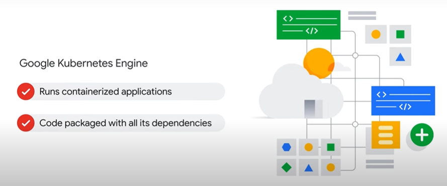

# Associate Cloud Engineer

## Getting Started with Google Kubernetes Engine"

## 1º Módulo - Introdução ao Google Cloud

- Introdução
- A computação em nuvem e o Google Cloud
- Soluções de computação do Google Cloud
    - Compute Engine
    
    - GKE
    
    - App Engine
    
    - Cloud Functions
    
    - Cloud Run
    
- A rede do Google
- Gerenciamento de recursos
- Faturamento
- Interação com o Google Cloud
- Intro ao LAB: Como acessar o console do Cloud e o Cloud Shell
- LAB: Como acessar o console do Cloud e o Cloud Shell

### Questões

1. 