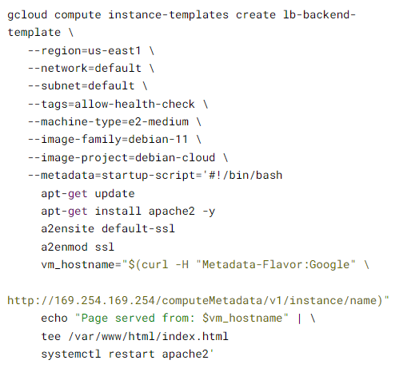

# Associate Cloud Engineer

## Implement Load Balancing on Compute Engine

Sequência de laboratórios

- LAB: Como criar uma máquina virtual
    - Comandos úteis:
        - `gcloud auth list`
        - `gcloud config list project`
        - `gcloud config set compute/region us-east1`
        - `gcloud compute instances create gcelab2 --machine-type e2-medium --zone=$ZONE`
        - `gcloud compute instances create --help`
        - `gcloud compute ssh gcelab2 --zone=$ZONE`

---

- LAB: Compute Engine: Qwik Start - Windows
    - Comandos úteis:
        - `gcloud compute instances get-serial-port-output [instance] --zone=us-central1-f`
        - `gcloud compute reset-windows-password [instance] --zone us-central1-f --user [username]`

---

- LAB: Para começar com o Cloud Shell e a gcloud
    - Comandos úteis:
        - `gcloud config get-value compute/region`
        - `gcloud config get-value compute/zone`
        - `gcloud config get-value project`
        - `gcloud compute project-info describe --project $(gcloud config get-value project)`
        - `gcloud -h`
        - `gcloud config list --all`
        - `gcloud components list`
        - `gcloud compute instances list --filter="name=('gcelab2')"`
        - `gcloud compute firewall-rules list`
        - `gcloud compute firewall-rules list --filter="network='default'"`
        - `gcloud compute firewall-rules list --filter="NETWORK:'default' AND ALLOW:'icmp'"`
        - `gcloud compute instances add-tags gcelab2 --tags http-server,https-server`
        - `gcloud compute firewall-rules create default-allow-http --direction=INGRESS --priority=1000 --network=default --action=ALLOW --rules=tcp:80 --source-ranges=0.0.0.0/0 --target-tags=http-server`
        - `gcloud compute firewall-rules list --filter=ALLOW:'80'`
        - `curl http://$(gcloud compute instances list --filter=name:gcelab2 --format='value(EXTERNAL_IP)')`
        - `gcloud logging logs list`
        - `gcloud logging logs list --filter="compute"`
        - `gcloud logging read "resource.type=gce_instance" --limit 5`
        - `gcloud logging read "resource.type=gce_instance AND labels.instance_name='gcelab2'" --limit 5`

---

- LAB: Configurar balanceadores de carga HTTP e de rede
    - Comandos úteis:
        - `gcloud compute instances create www1 --zone=us-east1-b --tags=network-lb-tag --machine-type=e2-small --image-family=debian-11 --image-project=debian-cloud --metadata=startup-script='#!/bin/bash apt-get update apt-get install apache2 -y service apache2 restart echo " <h3>Web Server: www1</h3>" | tee /var/www/html/index.html'`
        - `gcloud compute firewall-rules create www-firewall-network-lb --target-tags network-lb-tag --allow tcp:80`
        - `gcloud compute addresses create network-lb-ip-1 --region us-east1`
        - `gcloud compute http-health-checks create basic-check`
        - `gcloud compute target-pools create www-pool --region us-east1 --http-health-check basic-check`
        - `gcloud compute target-pools add-instances www-pool --instances www1,www2,www3`
        - `gcloud compute forwarding-rules create www-rule --region  us-east1 --ports 80 --address network-lb-ip-1    --target-pool www-pool`
        - `gcloud compute forwarding-rules describe www-rule --region us-east1`
        - `IPADDRESS=$(gcloud compute forwarding-rules describe www-rule --region us-east1 --format="json" | jq -r .IPAddress)`
        - 
        - `gcloud compute instance-groups managed create lb-backend-group --template=lb-backend-template --size=2 --zone=us-east1-b`
        - `gcloud compute firewall-rules create fw-allow-health-check --network=default --action=allow  --direction=ingress --source-ranges=130.211.0.0/22,35.191.0.0/16 --target-tags=allow-health-check --rules=tcp:80`
        - `gcloud compute addresses create lb-ipv4-1 --ip-version=IPV4 --global`
        - `gcloud compute health-checks create http http-basic-check --port 80`
        - `gcloud compute backend-services create web-backend-service --protocol=HTTP --port-name=http  --health-checks=http-basic-check --global`
        - `gcloud compute backend-services add-backend web-backend-service --instance-group=lb-backend-group  --instance-group-zone=us-east1-b --global`
        - `gcloud compute url-maps create web-map-http --default-service web-backend-service`
        - `gcloud compute target-http-proxies create http-lb-proxy --url-map web-map-http`
        - `gcloud compute forwarding-rules create http-content-rule --address=lb-ipv4-1 --global  --target-http-proxy=http-lb-proxy --ports=80`

---

- LAB: Implementando Load Balancing no Compute Engine: LAB com desafio
    - 